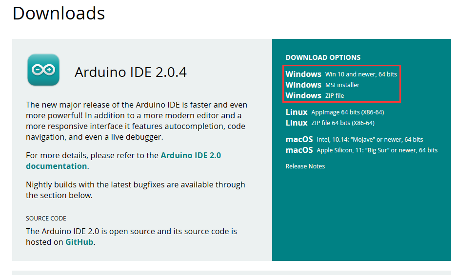
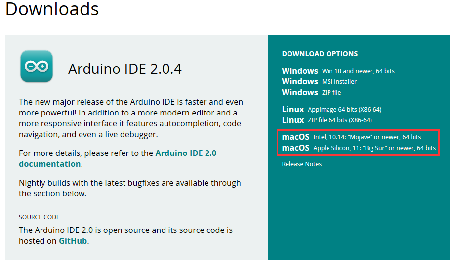

# **Development Software and Driver Installation**

### **1.Install Arduino IDE**

#### **1.2 For Windows**

Arduino official website: https://www.arduino.cc/

Enter the website and click **SOFTWARE** on that page to download the latest Arduino software:

Widows, mac and Linux operation system are available for Arduino (as shown below), so please ensure the one you download is compatible with your computer.

Herein, Windows will be demonstrated as an illustration of how to download and install. 

Two versions are provided for Windows: for installing and for downloading(a zipped file).

Click **JUST DOWNLOAD** to download the software. 

#### **1.2 For Mac**

For Mac, Arduino IDE downloading is similar to Windows:

### **2.Install Development Board Driver**

After installing Arduino IDE, a driver is required. Nano development board adopts CH340G as its serial driver IC.

#### **2.1 For Windows**

Connect the control board to computer via USB. For Windows 10, the driver will be automatically installed in most cases. For Windows 7 and others, you should install it manually. 

USB-to-serial port chip of the board is CH340, whose driver(usb_ch341_3.1.2009.06) is also required. 

.png)

If the control board is connected to your computer for the first time, please click Computer--Attributes--Device Manager:

.png)

Click USB Serial and “**Update Driver**” for installation.

.png)

The following interface will show up. Please select to browse my computer for drivers. 

.png)

Find file **usb_ch341_3.1.2009.06** and click browse... and next

.png)

Close the page after installation, and then the serial port number appears.

.png)

Finally, click Computer--Attributes--Device Manager:

.png)

#### **2.2 For MAC**

Please refer to:

https://wiki.keyestudio.com/Download_CH340_Driver_on_MAC_System

### **3.Arduino IDE Settings and Toolbar**

#### **3.1 For Windows**

Firstly, open Arduino IDE.

.png)

Choose the correct Arduino board which is compatible with the circuit connected to computer. Click Tools→Board to select Arduino NANO.

.png)

Choose the corresponding COM port, which can be seen after successful installation.

.png)

#### **3.2 For MAC**

The setting method of Arduino IDE resembles that of Windows. The only difference is COM port:

-1.png)

### **4.Operate the First Program**

Let's start to operate programs! Open File to select the example code, select the **BLINK** code in **BASIC**.

.png)

Referring to previous steps, set the board and COM port, which will be displayed at the right bottom of IDE. Click icon “√” to start compiling and examining code. Or more simply, directly click “→” to compile and upload code to the board.

.png)

A successful uploading is shown below: 

.png)

The result is, on-board LED blinks with on for 1s and off for 1s. Congratulations! You have accomplished your first program! 

Arduino programming language consists of three main parts: function, value(variable and constant) and structure. If you are interested in details, please refer to Arduino official tutorials: https://www.arduino.cc/reference/en/

### **5.Add Libraries**

Before starting our projects, libraries need to be added in the sofware.

#### **5.1 What Is A Library?**

A library is a collection of codes, and it facilitate the connection of sensors, monitors and modules. 

For instance, in-built LiquidCrystal library simplifies the communication with LCD display. Moreover, hundreds of libraries are available on Internet. In the reference, in-built and manually-added libraries are listed.  

#### **5.2 How to Install A Library?**

Firstly, click Sketch>Include Library>Add .Zip Library... in sequence.

.png)

Select the zipped files you need and click ok to add as a library. If success, the message bar will show “Library installed”.

.png)

For more tutorials and products, please visit our official website: https://www.keyestudio.com/
