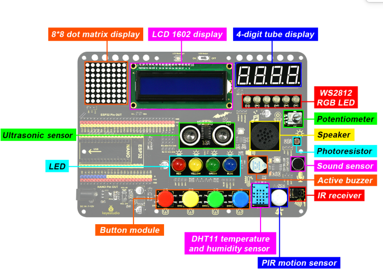

# **Inventor Starter Kit Expansion Board**

#### **1.Introduction**

This expansion board is compatible with Keyestudio Nano Plus development board and Keyestudio ESP32 development board. The voltage on VCC can be set to 3.3V (ESP32) or 5V(Nano) via a DIP switch.

On the board, multiple modules and sensors are integrated. They are four buttons, four LED(red, yellow, green, blue), six WS2812 RGB LED, a buzzer, a PIR motion sensor, a IR receive sensor, a sound sensor, a photoresistor, an 8002 amplifier, a potentiometer, an ultrasonic sensor, a 4-bit digital tube display, an 8x8 dot matrix display and an LCD 1602 display. 

For an easy wiring and to avoid a wrong-wiring-caused burnout, external VCC and GND are not required for all these modules and sensors. What's more, each pin possesses its own VCC and GND, which brings a higher compatibility to the board and provides more opportunities for extended learning of other modules. 

#### **2.Parameters**

**Working voltage:** 5V / 3.3V

**DC power supply:** 7-12V

**USB power supply:** 5V

**Working current:** ≥35mA

**Working temperature:** –10°C ~ +65°C

**Dimension:** 180x131x28(mm)

#### **3.Module Location**

#### **4.Pin and Switch Description**

