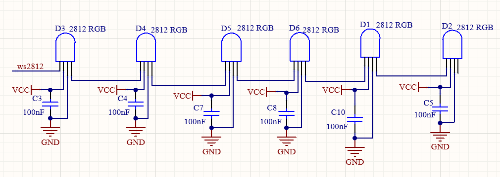

# **Project 5：Rainbow Ambient Light**

### **1. Description**
Arduino 2812RGB LED is a programable colorful dreamy light, whose lighting color, brightness and rhythm are adjustable. This rainbow ambient light can used as a dynamic decoration at will. Or you may control it to "dance with music".

Importantly, it can be improved as an alarm. Its built-in sensor detects the ambient surroundings to warn users by changing lighting colors, brightness and rhythm.

### **2. Working Principle**



**Working Principle:** 

The data protocol adopts communication mode of single-line RTZ code. 

After powering on and pixel resetting, DIN terminal receives data from the controller. The firstly arriving 24bit data will be extracted by the first pixel and be sent to the inner data register. 

Remaining data will be amplified by an amplification circuit and be transmitted through DOUT port to the next cascaded pixel. 
Being transmitted through pixels, the signal decreases 24bit each time. 

Besides, the automatic amplification and transmitting technology offer unlimited number of cascade from signal transmitting, yet it is limited by transmitting speed. 

### **3. Wiring Diagram**


### **4. Test Code**

Before uploading the code, please ensure the library file is loaded to arduino IDE. Otherwise, an error may occur. 
Many codes in the library can be directly recalled. 

```C
/*
  keyestudio Nano Inventor Starter Kit
  Project 5  Rainbow Ambient Light
  http://www.keyestudio.com
*/
//Add 2812RGB library file
#include <NeoPixel.h>
Adafruit_NeoPixel  rgb_display(8);  //Define a class of pixels

void setup() {
  rgb_display.begin();  //Activate 6812RGB
  rgb_display.setPin(8);  //Set 2812 pin to digital port 8
  rgb_display.setBrightness(100); //Set the brightness to 100, within the range of 0~255
}

void loop() {
  rgb_display.setPixelColor(0, 255, 0, 0); //The frist pixel color is red
  rgb_display.setPixelColor(1, 0, 255, 0); //The second pixel color is green
  rgb_display.setPixelColor(2, 0, 0, 255); //The third pixel color is blue
  rgb_display.setPixelColor(3, 255, 255, 0); //The fourth pixel color is yellow
  rgb_display.setPixelColor(4, 255, 0, 255); //The fifth pixel color is purple
  rgb_display.setPixelColor(5, 255, 255, 255); //The sixth pixel color is white
  rgb_display.show(); //Display the pixel color
  delay(100);

}
```

### **5. Test Result**

After uploading code, wiring up and powering on, the LED will light up in different colors.


### **6. Expansion Code**

Code for a mini light show as follows. Specifically, we replace RGB value with variables. And then we control these variables to form an expected light show. 

**The wiring remain unchanged.**

**Code:**

```C
/*
  keyestudio Nano Inventor Starter Kit
  Project 5.2  Rainbow Ambient Light
  http://www.keyestudio.com
//Add 2812RGB library file
*/
#include <NeoPixel.h>
#ifdef __AVR__
#include <avr/power.h>
#endif

#define PIN 8

// Parameter 1 = number of pixels in strip
// Parameter 2 = Arduino pin number (most are valid)
// Parameter 3 = pixel type flags, add together as needed:
//   NEO_KHZ800  800 KHz bitstream (most NeoPixel products w/WS2812 LEDs)
//   NEO_KHZ400  400 KHz (classic 'v1' (not v2) FLORA pixels, WS2811 drivers)
//   NEO_GRB     Pixels are wired for GRB bitstream (most NeoPixel products)
//   NEO_RGB     Pixels are wired for RGB bitstream (v1 FLORA pixels, not v2)
Adafruit_NeoPixel strip = Adafruit_NeoPixel(6, PIN, NEO_GRB + NEO_KHZ800);

// IMPORTANT: To reduce NeoPixel burnout risk, add 1000 uF capacitor across pixel power leads, add 300 - 500 Ohm resistor on first pixel's data input and minimize distance between Arduino and first pixel.  Avoid connecting on a live circuit...if you must, connect GND first.

void setup() {
  // This is for Trinket 5V 16MHz, you can remove these three lines if you are not using a Trinket
  #if defined (__AVR_ATtiny85__)
    if (F_CPU == 16000000) clock_prescale_set(clock_div_1);
  #endif
  // End of trinket special code


  strip.begin();
  strip.show(); // Initialize all pixels to 'off'
}

void loop() {
  // Some example procedures showing how to display to the pixels:
  colorWipe(strip.Color(255, 0, 0), 50); // Red
  colorWipe(strip.Color(0, 255, 0), 50); // Green
  colorWipe(strip.Color(0, 0, 255), 50); // Blue
  // Send a theater pixel chase in...
  theaterChase(strip.Color(127, 127, 127), 50); // White
  theaterChase(strip.Color(127, 0, 0), 50); // Red
  theaterChase(strip.Color(0, 0, 127), 50); // Blue

  rainbow(20);
  rainbowCycle(20);
  theaterChaseRainbow(50);
}

// Fill the dots one after the other with a color
void colorWipe(uint32_t c, uint8_t wait) {
  for(uint16_t i=0; i<strip.numPixels(); i++) {
    strip.setPixelColor(i, c);
    strip.show();
    delay(wait);
  }
}

void rainbow(uint8_t wait) {
  uint16_t i, j;

  for(j=0; j<256; j++) {
    for(i=0; i<strip.numPixels(); i++) {
      strip.setPixelColor(i, Wheel((i+j) & 255));
    }
    strip.show();
    delay(wait);
  }
}

// Slightly different, this makes the rainbow equally distributed throughout
void rainbowCycle(uint8_t wait) {
  uint16_t i, j;

  for(j=0; j<256*5; j++) { // 5 cycles of all colors on wheel
    for(i=0; i< strip.numPixels(); i++) {
      strip.setPixelColor(i, Wheel(((i * 256 / strip.numPixels()) + j) & 255));
    }
    strip.show();
    delay(wait);
  }
}

//Theatre-style crawling lights.
void theaterChase(uint32_t c, uint8_t wait) {
  for (int j=0; j<10; j++) {  //do 10 cycles of chasing
    for (int q=0; q < 3; q++) {
      for (int i=0; i < strip.numPixels(); i=i+3) {
        strip.setPixelColor(i+q, c);    //turn every third pixel on
      }
      strip.show();

      delay(wait);

      for (int i=0; i < strip.numPixels(); i=i+3) {
        strip.setPixelColor(i+q, 0);        //turn every third pixel off
      }
    }
  }
}

//Theatre-style crawling lights with rainbow effect
void theaterChaseRainbow(uint8_t wait) {
  for (int j=0; j < 256; j++) {     // cycle all 256 colors in the wheel
    for (int q=0; q < 3; q++) {
      for (int i=0; i < strip.numPixels(); i=i+3) {
        strip.setPixelColor(i+q, Wheel( (i+j) % 255));    //turn every third pixel on
      }
      strip.show();

      delay(wait);

      for (int i=0; i < strip.numPixels(); i=i+3) {
        strip.setPixelColor(i+q, 0);        //turn every third pixel off
      }
    }
  }
}

// Input a value 0 to 255 to get a color value. The colours are a transition r - g - b - and tback to r.
uint32_t Wheel(byte WheelPos) {
  WheelPos = 255 - WheelPos;
  if(WheelPos < 85) {
    return strip.Color(255 - WheelPos * 3, 0, WheelPos * 3);
  }
  if(WheelPos < 170) {
    WheelPos -= 85;
    return strip.Color(0, WheelPos * 3, 255 - WheelPos * 3);
  }
  WheelPos -= 170;
  return strip.Color(WheelPos * 3, 255 - WheelPos * 3, 0);
}
```

### **6. Code Explanation**

**#include <Adafruit_NeoPixel.h>** 
Libraries are included, so that codes in library can be directly recalled. 

**Adafruit_NeoPixel  rgb_display(6);** 
Set the number of employed 2812 RGB. Here we input 6.

**rgb_display.begin();** 
Initialize 2812RGB. This is essential. 

**rgb_display.setPin(8);** 
Set the connected pin of 2812RGB. This is also necessary. 

**rgb_display.setBrightness(100);** 
Set the brightness of 2812RGB within range of 0~255. The greater the value is, the brighter the LED will be. 
The default brightness value is 255, which is also the brightest. 

**rgb_display.setPixelColor(uint16_t n, uint8_t r, uint8_t g, uint8_t b);** 
rgb_display.setPixelColor(pixel number, red, green, blue): Set the pixel number of 2812RGB and the color value of each LED.


**rgb_display.show();** 
Display 2812RGB. It is this important statement that refreshes the display of LED.

