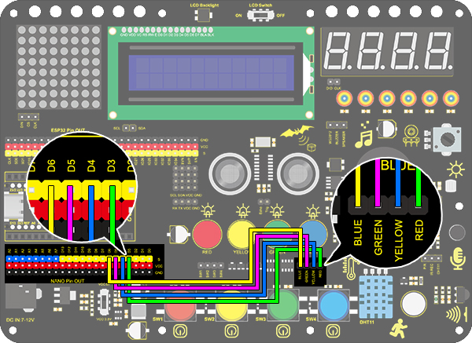

# **Project 6：Water Flow Light**

### **1. Description**
This simple water flow light project guides you in electronic packaging. In this project, we control LED to shift the color in a specified speed. 

### **2. Wiring Diagram**



### **3. Test Code**

A water flow light consists of a stream of LED lighting from left to right and vice versa. 

In this experiment, we use continuous pins, so that "for" statement can be utilized not only to set output mode (we replace pins with circular variable in code) but also to output. 


```C
/*
  keyestudio Nano Inventor Starter Kit
  Project 6 Water Flow Light
  http://www.keyestudio.com
*/
void setup() {
  for(int i = 3;i <= 6 ;i++){   //"for" loop statement, set D3-D6 pin to output mode
    pinMode(i,OUTPUT);
  }
}

void loop() {
  for(int i = 3; i <= 6; i++){		//Use for loop statement to light up LED on D3-D6 pin in sequence
    digitalWrite(i,HIGH);
    delay(200);
    digitalWrite(i,LOW);
  }
  for(int i = 6; i >= 3; i--){		//Use for loop statement to light up LED on D6-D3 pin in sequence
    digitalWrite(i,HIGH);
    delay(200);
    digitalWrite(i,LOW);
  }
}
```

### **4. Test Result**

After uploading code and powering on, the stream of LED light up from left to right and vice versa in a loop.


### **5. Code Explanation**

**for(int i = 3;i <= 6 ;i++){    pinMode(i,OUTPUT);    }** 
We use "for" statement to define continuous pins. Yet it features a disadvantage of non-replacement ability of pins, which deteriorates the code portability. 

**for(int i = 3; i <= 6; i++){
    		digitalWrite(i,HIGH);
    		delay(200);
    		digitalWrite(i,LOW);
  }** 

In the first loop, LED on D3 pin will light up and will be off after a 200ms delay. At the second time, LED on D4 pin will turn on and will turn off also after a 200ms delay. By that analogy, the execution will be out of the loop when LED on D6 pin goes off. 

Similarly, another "for" loop shares the common principle. The only difference is LED lighting from D6 to D3. 
