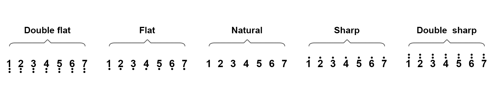

# **Project 8：Music Performer**

### **1. Description**
This project realizes a music player with an amplifier on the development board. This speaker can not only play simple songs, but also perform music made by yourself. Thus, you can program other interesting codes in the project to accomplish splendid learning outcomes.

### **2. Working Principle**


**Working principle:** 

The electrical signal is input from pin 1 of RP1 (adjusts signal intensity, which is also the sound volume). After coupling in C4 and passing R5, the signal reaches IN- pin of 8002B, in which it is operationally amplified and output to BEE1 speaker. 


**Frequency Comparison Table in C**

|    Note     | Frequency(Hz) |      Note      | Frequency(Hz) |     Note     | Frequency(Hz) |
| :---------: | :-----------: | :------------: | :-----------: | :----------: | :-----------: |
| Flat  1  Do |      262      | Natural  1  Do |      523      | Sharp  1  Do |     1047      |
| Flat  2  Re |      294      | Natural  2  Re |      587      | Sharp  2  Re |     1175      |
| Flat  3  Mi |      330      | Natural  3  Mi |      659      | Sharp  3  Mi |     1319      |
| Flat  4  Fa |      349      | Natural  4  Fa |      698      | Sharp  4  Fa |     1397      |
| Flat  5  So |      392      | Natural  5  So |      784      | Sharp  5  So |     1568      |
| Flat  6  La |      440      | Natural  6  La |      880      | Sharp  6  La |     1760      |
| Flat  7  Si |      494      | Natural  7  Si |      988      | Sharp  7  Si |     1967      |

### **3. Wiring Diagram**


### **4. Test Code**

According to the comparison table, we set a pin to output mode. And we use function "**tong(Pin , frequency);**" to generate square waves in certain frequency to emit corresponding sound. Finally, the notes will be output after adding a delay time.

```C
/*
  keyestudio Nano Inventor Starter Kit
  Project 8.1 Music Performer
  http://www.keyestudio.com
*/
int beeppin = 6; //Define the speaker pin to D6
void setup() {
  pinMode(beeppin, OUTPUT);//Define the amplifier digital port to output mode
}

void loop() {
  tone(beeppin, 262);//Flat DO plays 500ms
  delay(500);
  tone(beeppin, 294);//Flat Re plays 500ms
  delay(500);
  tone(beeppin, 330);//Flat Mi plays 500ms
  delay(500);
  tone(beeppin, 349);//Flat Fa plays 500ms
  delay(500);
  tone(beeppin, 392);//Flat So plays 500ms
  delay(500);
  tone(beeppin, 440);//Flat La plays 500ms
  delay(500);
  tone(beeppin, 494);//Flat Si plays 500ms
  delay(500);
  noTone(beeppin);//Stop for 1s
  delay(1000);
}
```

### **5. Test Result**

After uploading code and powering on, the amplifier circularly plays music tones with corresponding frequency: DO, Re, Mi, Fa, So, La, Si.

### **6. Expansion Code**

For a little more complicated, let's play a birthday song.

**The wiring remains unchanged.**

**Numbered musical notation:**


**Comparison Diagram of Flat, Natural and Sharp**



**Code:**

~~~C
/*
  keyestudio Nano Inventor Starter Kit
  Project 8.2 Music Performer
  http://www.keyestudio.com
*/
int beeppin = 6; //Define the speaker pin to D6 do、re、mi、fa、so、la、si
int doremi[] = {262, 294, 330, 370, 392, 440, 494,      //Falt 0-6
                523, 587, 659, 698, 784, 880, 988,      //Natural 7-13
                1047,1175,1319,1397,1568,1760,1967};    //Sharp 14-20
int happybirthday[] = {5,5,6,5,8,7,5,5,6,5,9,8,5,5,12,10,8,7,6,11,11,10,8,9,8};   // Find the number in arrey doremi[] according to the numbered musical notation
int meter[] = {1,1,2,2,2,4, 1,1,2,2,2,4, 1,1,2,2,2,2,2, 1,1,2,2,2,4};    // Beats

void setup() {
  pinMode(beeppin, OUTPUT); //Set beeppin to output mode
}

void loop() {
  for( int i = 0 ; i <= 24 ;i++){       //i<=24, because there are only 24 tones in this song
    //Use tone()function to generate a waveform in "frequency"
   tone(beeppin, doremi[happybirthday[i] - 1]);
   delay(meter[i] * 200); //Wait for 1000ms
   noTone(beeppin);//Stop singing
  }
}

~~~

###  **7. Code Explanation**

**doremi[]{ … };**
Linear array is used to store data, which generally are considered as a series of variables of the same type. 
Analogically, data are neatly put in ordered boxes, so that we can take the sequenced numbers to use corresponding data.

**tone(pin, frequency)；** 
"pin" is the arduino pin generating tones in a total of 6 pins.  "frequency" is the note frequency in the unit of Hz. 

**unsigned int** is the data type within range of 0 ~ 65, 535 ((2^16) - 1).

1. "tone" function controls the module to generate square waves in certain frequency(duty cycle of 50％). It sings until "noTone()" (Stop to sing) is activated. 
2. Tones can be emitted by connecting the pin to a piezoelectric buzzer or other speakers. 
3. For each time, tone() generates only one type of tone. Thus, if a tone is played on some pin, this function will be invalid. 
4. tone()function disturbs the PWM output on pin 3 and pin 11 (on any board excluding Mega). 
5. The sound frequency generated by tone() must be no less than 31Hz. So when you play tones in different frequency on numerous pins, noTone() is necessary on one pin and followed by tone() on next pin.

**noTone(beeppin);** stops the tone generation(stops singing). You can directly add the pin number in it. 

