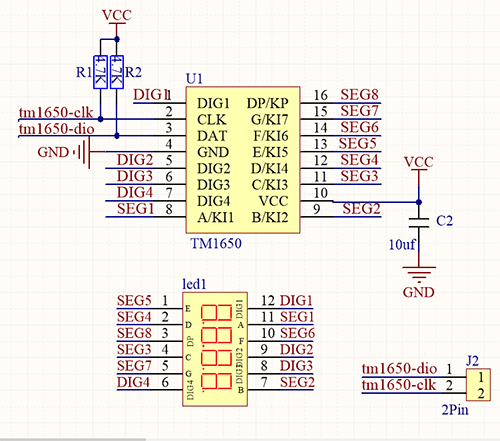
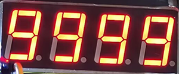

# **Project 9：Digital Tube Display**

### **1. Description**
This display module, whose display range includes 0 ~ 9 and simple letters, consists of four digital tubes with seven LED on each and can be used as a counter or a clock.

Moreover, multiple functions can be realized by connecting their pins to the development board, such as timekeeping and some game storing. 

### **2. Working Principle**



TM1650 utilizes IIC protocol and adopts two bus lines (SDA and SCL).

**Data Command:** 0x48.  This command directs TM1650 to light up the digital tubes rather than key scanning.

**Display Command:**


Actually, it is one byte of data with different bits representing different functions.
**bit[6:4]:** Set the brightness of LED. Note that 000 indicates the brightest. 
**bit[3]:** Determine whether there is a decimal dot. 
**bit[0]:** Determine whether to turn on the display.

**Digital Tube Turns on**
Take an example: Level 8 brightness without a dot signifies 0x05. 
Steps: Starting signal — Send 0x48 — Slave-device receives — Send 0x05 — Slave-device receives — Ending signal
After turning on, there is no need to repeatedly send 0x48, as the function of digital tube has confirmed. 
Besides, the brightness and display methods can be enumerated with multiple data in one place, so that it is clear and space-saving.

**Digital Tube Turns off**
Steps: Starting signal — Send 0x48 — Slave-device receives — Send 0x00 — Slave-device receives — Ending signal

**Digital Tube Displays Numbers**
We firstly direct TM1650 to display numbers on the predetermined tube. 
And then the number will be displayed. Its eight bit corresponds to eight segment, with 1 for lighting up and 0 for lighting out. 
If there is a doubt of the corresponding relation, you may light up bit by bit in loop.

For example, when bit 1 is turned on and displays 8, the data is 0x68. If there is a dot, 8 will also be displayed when sending 0x7f.
Steps: Starting signal — Send 0x68 — Slave-device receives — Send 0x7f — Slave-device receives — Ending signal
Result: 8 is displayed on Bit 1. 

For convenience, an array of corresponding value to 0~9 can be made. After further improvement, it is able to display numbers, adjust brightness, shift the decimal dot and tubes.

### **3. Wiring Diagram**


### **4. Test Code**

Upload library files on Arduino IDE. If you skip this step, an error will occur when uploading and compiling codes. 

For how to add libraries, please refer to “Development Environment Configuration”.

**Code:**

```C
/*
  keyestudio Nano Inventor Starter Kit
  Project 9.1 Digital Tube Display 
  http://www.keyestudio.com
*/
#include "KETM1650.h" //Upload TM1650 library files
KETM1650 tm_4display(A5,A4);  //Define tm_4display example and set pin interfaces to A5 and A4

void setup(){
  tm_4display.init(); //Initialization 
  tm_4display.setBrightness(3); //Set the brightness to 3 (within the range of 1~8)
}

void loop(){
    tm_4display.displayString(9999);//Digital tube displays 9999
}
```

### **5. Test Result**

After wiring up and uploading code, the digital tube display shows "9999", as shown below. 




### **6. Expansion Code**

Let's have some difficult operations. Rather than static numbers, we handle it to show some dynamic ones.  The following code manipulates the tubes to display 1~9999 by "for" loop.

**The wiring remains unchanged.**

**Code:**

```c
/*
  keyestudio Nano Inventor Starter Kit 
  Project 9.2 Digital Tube Display 
  http://www.keyestudio.com
*/
#include "KETM1650.h" //Upload TM1650 library files
KETM1650 tm_4display(A5,A4);  //Define tm_4display example and set pin interfaces to A5 and A4

void setup(){
  tm_4display.init(); //Initialization 
  tm_4display.setBrightness(3); //Set the brightness to 3 (within the range of 1~8)
}

void loop(){

  for(int i = 0 ; int <= 9999 ; i++){
    tm_4display.displayString(i);//Digital tube displays i
    delay(100); //Delay 100ms
  }
}
```

### **7. Code Explanation**

**.init();** 
Initialize TM1650.

**.clear();** 
Clear the display. 

**.displayString(char * aString);**
Display character string. *aString indicates the contents of the character string to aString.

**.displayString(String sString);** 
Display character string. sString is the character string.

**.displayString(float value);** 
Display decimals in the format of float.

**.displayString(double value);** 
Display decimals in the format of double.

**.displayString(int value);** 
Display integers in the format of int.

**.displayOn();** 
Turn on the digital tube display. 

**.displayOff();** 
Turn off the digital tube display. Differed from ".clear", once it turns off, reuse **.displayOn();** to redisplay. 

**.setDot(unsigned int aPos, bool aState);** 
Display decimal dot. aPos represents the position of the dot(0~3 is 1~4). aState means the display state, 1(true) for lighting up, and 2(false) for lighting out. 

**.setBrightness(unsigned int iBrightness);** 
Set the brightness of LED. "iBrightness" is the level of brightness(1~8) in "unsigned int". A maximum or minimum is automatically set if the brightness value is out of range.


For more details, please refer to the code annotations and explanations. 
