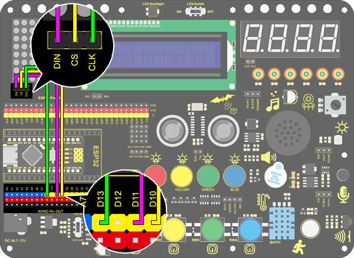

# **Project 10：Dot Matrix Display**

### **1. Description**
This module consists of a 8x8 LED dot matrix with one control pin for each row as well as each column to adjust the brightness of LED. 

Connecting with Arduino board, the brightness of LED is controlled via programs. In this way, simple characters and figures are able to be displayed. It also can be applied in game machines or screens.

### **2. Working Principle**


**Working Principle:** 
MAX7219 is an IC with SPI communication and controls 8x8 dot matrix. The MAX7219 SPI communication has integrated in our libraries and you can recall directly.

### **3. Dot Matrix Modulo Operation**

Click the link for Modulo: [http://dotmatrixtool.com/#](http://dotmatrixtool.com/#)

**Operating process:** 
1.Click the link and set the height and width of the dot matrix. Here we set both to 8. 


2.Set "Byte Order" to "Column Major".


3.Set "Endian" to "Big Endian (MSB)".


4.Click the white tiles to form a pattern you want(click again to be deselected), and then click "Generate" to generate an array for this icon. Copy this array and paste it in code, and then the pattern will be displayed on the dot matrix.


### **4. Wiring Diagram**



### **5. Test Code**

Add libraries to Arduino IDE. If you skip this step, an error will occur when uploading and compiling the code. For how to add libraries, please refer to “Development Environment Configuration”. 

```c
/*
  keyestudio Nano Inventor Starter Kit
  Project 10 Dot Matrix Display
  http://www.keyestudio.com
*/
#include <LedControl.h>  
  
int DIN = 11;     //Define DIN pin to D11
int CS =  10;     //Define CS pin to D10
int CLK = 13;     //Define CLK pin to D13
  
LedControl lc = LedControl(DIN,CLK,CS,4); //Upload DIN, CS, CLK pin to library
byte neutral[8]= {0x30, 0x78, 0x7c, 0x3e, 0x3e, 0x7c, 0x78, 0x30};//Data of the heart

void setup(){  
 lc.shutdown(0,false);       //When powering on, MAX72XX is in power saving mode. 
 lc.setIntensity(0,8);       //Set the brightness to the maximum
 lc.clearDisplay(0);         //Clear the display 
}  
  
void loop(){   
    printByte(neutral);//Diaplay a heart
}  
  
//Dot Matrix Display Function
void printByte(byte character [])  
{  
  int i = 0;  
  for(i=0;i<8;i++)  
  {  
    lc.setRow(0,7-i,character[i]);  	
  }  
}  
```

### **6. Test Result**

After wiring up and uploading code, a heart will be displayed on the dot matrix, as shown below.


### **7. Code Explanation**

**lc.shutdown(0,false);** 
Select the state of power saving mode, with false for exiting and true for entering. It will not display anything if entering this mode.

**lc.setIntensity(0,8);** 
Set the range of brightness intensity to level 0-8, among which 8 is the brightest.

**lc.clearDisplay(0);** 
Clear the pattern displayed on the dot matrix. 

**void printByte(byte character [ ]){ … }** 
User-defined function. It package the required "for" statement. In this way, we can directly use this function when a loop()function is needed. 
