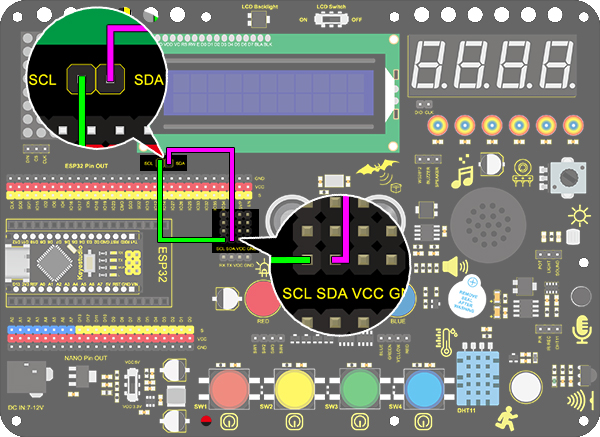

# **Project 11: LCD**

### **1. Description**
Arduino I2C 1602 LCD is a commonly-used auxiliary device for MCU development board to connect with external sensors and modules. It features a 16-bit wide character and 2-line LCD screen, whose brightness is adjustable. 

This programmable module is convenient for data editing, displaying and managing. Besides, it can display not only characters and figures but sensors value, like temperature, humidity or pressure value. 

As a result of its usability, the display is wildly applied in many fields, including smart home, industrial monitoring system, robot control and automatics' electronics.

### **2. Working Principle**


**Working Principle:** 
It is the same as IIC communication principle. Underlying functions have packaged in libraries so that you can recall them directly. 
If you are interested in these, you may have a further look of underlying driving principles. 

### **3. Wiring Diagram**



### **4. Test Code**

Add libraries to Arduino IDE. If you skip this step, an error will occur when uploading and compiling the code.

For how to add libraries, please refer to “Development Environment Configuration”. 

```c
/*
  keyestudio Nano Inventor Starter Kit
  Project 11 LCD
  http://www.keyestudio.com
*/
#include <Wire.h>
#include <LiquidCrystal_I2C.h>
LiquidCrystal_I2C lcd(0x27,16,2); // set the LCD address to 0x27 for a 16 chars and 2 line display
void setup()
{
lcd.init(); // initialize the lcd
// Print a message to the LCD.
lcd.backlight();		//Turn on the LCD backlight
lcd.setCursor(2,0);		//Set the display position
lcd.print("Hello,world!");		//LCD displays "Hello, world!"
lcd.setCursor(2,1);	
lcd.print("keyestudio!");		//LCD displays "keyestudio!"
}
void loop()
{
}
```


### **5. Test Result**

After wiring up and uploading code, turn on the LCD, and "Hello, world!" and "keyestudio!" will displayed on the LCD. 

If the characters are unclear, please fix the backlight potentiometer by the small slotted screwdriver(included in this kit). Connect an external power supply if necessary.


### **6. Code Explanation**

**#include <LiquidCrystal_I2C.h>**	
"#include" is a "include" command of libraries, so we can recall functions in file.h (programs in library).

**LiquidCrystal_I2C lcd(0x27,16,2);** 
Define an LCD. 0x27 is its IIC address, and 16 means the number of columns(display 16 characters in total), and 2 is the number of rows.

**lcd.init();** 
Initialize LCD. 

**lcd.backlight();** 
Turn on LCD backlight, which clarifies the displayed characters. 

**lcd.setCursor(3,0);** 
Set the display position. (3,0) indicates the starting position is in the fourth column and first row.

**lcd.print("Hello, world!");** 
Define the displayed characters. Enclose the strings in quotation marks, for instance, lcd.print("Hello, world!"). The marks can be omitted if displaying one value, for example, lcd.print(value). 

