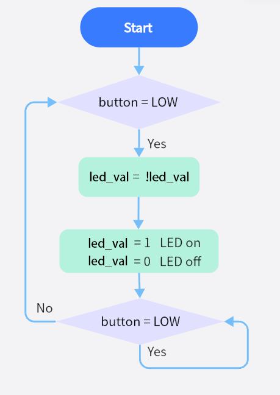

# **Project 13: Mini Lamp**

### **1. Description**
In this project, we control a lamp by Arduino Nano and a button. When we press the button, the state of the lamp will shift (ON or OFF).

### **2. Working Principle**


**Working Principle:** 
When the button is released, a voltage VCC passing through R29 provides a high level for S terminal. 
When it is pressed, pin 1 and 3, pin 2 and 4 are connected and voltage on S1 arrives GND as a low level. At this moment, R29 avoids a short circuit between VCC and GND.

### **3. Wiring Diagram**


### **4. Test Code**

Now that voltage is low when pressing the button, we can read the pin voltage value via "digitalRead(Pin)", 1 for high and 0 for low.

```C
/*
  keyestudio Nano Inventor Starter Kit
  Project 13.1 Mini Lamp
  http://www.keyestudio.com
*/
int button = 8;
int value = 0;
void setup() {
  Serial.begin(9600); //Set the serial baud rate to 9600
  pinMode(button, INPUT);  //Connect the button pin to digital port 8 and set it to output mode.
}

void loop() {
  value = digitalRead(button);//Read the button value
  Serial.print("Key status:"); //Print "Key status:" on serial port
  Serial.println(value); //Print the button variable on the serial port and convert
}
```

### **5. Test Result**

After wiring up and uploading code, open the serial monitor and set the baud rate to 9600. 

When we press the button, serial port prints "Key status: 0"; When we release the button, serial port prints "Key status: 1".


### **6. Expansion Code**

**Flow Diagram:**



**Wiring Diagram:**


**Code:**

Make a mini lamp by a button and an LED. 

```C
/*
  keyestudio Nano Inventor Starter Kit
  Project 13.2 Mini Lamp
  http://www.keyestudio.com
*/
int button = 8;  //Define the variable button to pin D8
int LED = 3;	//Define LED to pin D3
int led_val = 0;
void setup() {
  pinMode(button, INPUT);  //Connect the button pin to digital port 8 and set it to the input mode
  pinMode(LED, OUTPUT);  //Connect LED pin to digital port 3 and set it to output mode
}

void loop() {
  int button_val = digitalRead(button);//Read the D8 pin button value
  if (button_val == 0) {  //Determine whether the button value equals 0
    led_val = !led_val;   //'!' takes the inverse sign, if it is 1, it becomes 0 or 0 becomes 1
    digitalWrite(LED, led_val); //Turn on LED or LED off
    while(!digitalRead(button)); //Preventing the inability to turn on the LED light due to prolonged button pressing
  }
}
```

### **7. Code Explanation**

**pinMode(8, INPUT);** 
Set pin D8 on the development board to input, so that the state of button can be identified. When we press the button, D8 is at a low level(0). If we release it, D8 will be at high(1).

**button = digitalRead(8);** 
digitalRead(8) identifies the power level on digital pin D8, and assigns the read value (0 or 1) to button variable.

**Serial.begin(9600);** 
Set the serial baud rate. It is necessary to print value on serial port.

**Serial.print("Key status:");** 
Serial port prints value. Contents in print() will be printed. If it is character string, quotation marks are needed, for instance, "Key status:".

**Serial.println(button);** 
Wrap characters around. Serial port prints contents in println() in a new line. Here we print the button value.

**if (button == 0) { ... }** 
“if“ condition command. Determine whether button value equals 0. If it does, execute the code in “if{...}“; Otherwise, no execution.

**==** 
Determine whether values on the two sides of "==" equal.


Official Website: [https://www.arduino.cc/reference/en/](https://www.arduino.cc/reference/en/)


