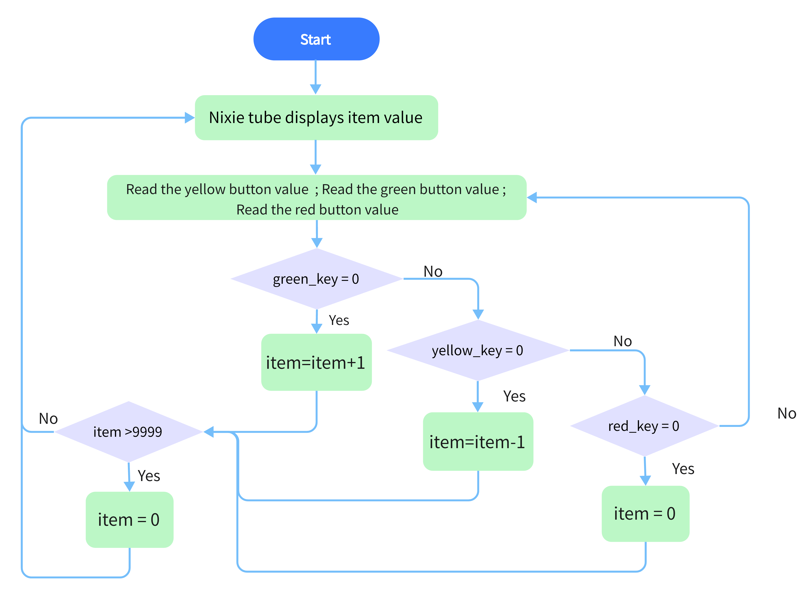
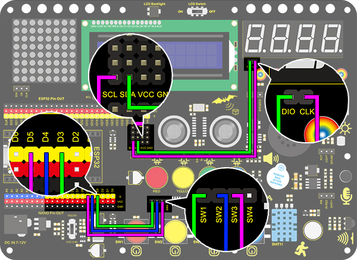

# **Project 14: Counter**

### **1. Description**
Arduino 4-bit digital tube counter can record numbers within 0~9999. It features display speed and counting mode adjustment as well as resetting function.  This module is wildly applied in real-time counter (such as button-press and DC motor rotation count), gaming and experiment equipment.

### **2. Flow Diagram**



### **3. Wiring Diagram**



### **4. Test Code**

At least, a counter includes three buttons: plus, minus, and reset(return to zero). 
We program "if" to determine the state of button, "pressed" for execution. For better results, we need to add a 200ms delay. 

```C
/*
  keyestudio Nano Inventor Starter Kit
  Project 14 Counter
  http://www.keyestudio.com
*/
#include "KETM1650.h" //Upload TM1650 library files
int item = 0; //Displayed value
KETM1650 tm_4display(A5,A4);  //The interfaces of two wires are A5 nd A4

int res = 3;     //Reset button
int subtract = 4;   //minus button
int  add = 5;       //plus button

void setup(){
    //set the pin connecting with button to input 
  pinMode(res,INPUT);
  pinMode(add,INPUT);
  pinMode(subtract,INPUT);
  tm_4display.init(); //Initialize the digital tubes. 
  tm_4display.setBrightness(3); //Set the brightness(range of 1~8) to 3
}

void loop(){
  tm_4display.displayString(item);//Digital tube displays item value
  int red_key = digitalRead(res);            // Red button is the reset button
  int yellow_key = digitalRead(subtract);    // Yellow button is minus 1
  int green_key = digitalRead(add);           // Green button is plus 1
  if(green_key == 0){
    item++;  //operate to add 1, item = item + 1
    delay(200);
  }
   if(yellow_key == 0){
    item--;		//operate to reduce 1, item = item - 1
    delay(200);
  }
   if(red_key == 0){
    item = 0;
    delay(200);
  }
  if (item > 9999) {  //return to zero when greater than 9999(excessing the display range) 
    item = 0; 
  }
}
```

### **5. Test Result**

After wiring up and uploading code, press green button to add 1, yellow to minus 1, and red to reset.  Press the button and hold, and the displayed value will keep adding or substracting.

