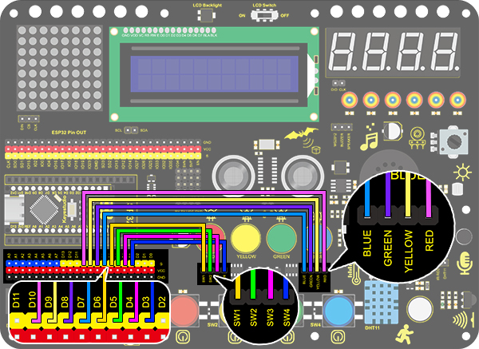

# **Project 15: Responder**

### **1. Description**
This programable responder inputs and receives signals through Arduino development board and a group of buttons, and it judges the correctness of answers by an LED.

Responders exercise students' reaction ability and draw their attention to questions. If the answer is correct, the respondent obtains a lot scores. 

Moreover, it simplifies teachers' manipulation of question-grabbers and cuts answer clutters. It may even stimulate students' interests in learning. 

### **2. Flow Diagram**


### **3. Wiring Diagram**



### **4. Test Code**

Imagine a question-master and three respondents. 

Respondents are allowed to grab questions only when the master presses the red button. Otherwise, their replies are invalid and lights are all off. Plus, if one of the three presses his/her button, the remaining two buttons are also invalid. 

```C
/*
  keyestudio Nano Inventor Starter Kit
  Project 15 Responder
  http://www.keyestudio.com
*/
int blue_key = 3;	//Set blue button to pin D3
int  green_key= 4;	//Set green button to pin D4
int yellow_key = 5;	//Set yellow button to pin D5
int red_key = 6;	//Set red button to pin D6

int blue_led = 7;	//Set blue LED to pin D7
int green_led = 8;	//Set green LED to pin D8
int yellow_led = 9;	//Set yellow LED to pin D9
int red_led = 10;	//Set red LED to pin D10

void setup(){
    //Set the pin connecting with button to input
  pinMode(blue_key,INPUT);	
  pinMode(green_key,INPUT);
  pinMode(yellow_key,INPUT);
  pinMode(red_key,INPUT);
 	//Set the pin connecting with button to output
  pinMode(blue_led,OUTPUT);
  pinMode(green_led,OUTPUT);
  pinMode(yellow_led,OUTPUT);
  pinMode(red_led,OUTPUT);

}

void loop(){
  int red_key_val = digitalRead(red_key);	//Read the red button value 
  digitalWrite(red_led,HIGH);				//Red LED lights up
  if(red_key_val == 0){				//Determine whether the red button is pressed
    digitalWrite(red_led,LOW);		//All LED go off
    digitalWrite(blue_led,LOW);
    digitalWrite(green_led,LOW);
    digitalWrite(yellow_led,LOW);
    delay(200);
    while(1){						//while()loop
      int blue_key_val = digitalRead(blue_key);		//Read the button value 
      int green_key_val = digitalRead(green_key);
      int yellow_key_val = digitalRead(yellow_key);
      if(blue_key_val == 0){						//Determine whether the blue button is pressed
        digitalWrite(blue_led,HIGH);				//Blue LED lights up
        break;										//Exit loop
      }
      if(green_key_val == 0){
        digitalWrite(green_led,HIGH);
        break;
      }
      if(yellow_key_val == 0){
        digitalWrite(yellow_led,HIGH);
        break;
      }
    }
  }
}
```

### **5. Test Result**

Wire up and upload the code. 

The answers of respondents are only valid when the red LED is off(red button is pressed). 

When someone presses his/her button(yellow, green or blue), the appropriate LED as well as the red counterpart lights up. By now, rest of LED cannot turn on when pressing buttons. The responding action can be performed only when the red button is pressed again. 

### **6. Code Explanation**

**while(1) { ... }** 
Unlimited loop function. 
When the expression or value in while() is True, the execution circulates in while{}. On the contrary, the loop quits when it is False. 
In this example, "1" in while(1) represents True, so code is on a loop when entering "while", which is endless. 

For how to exit, we need a "break" statement.

**break;** 
It is used to exit a loop. In our code, this statement breaks the "while" loop. 

