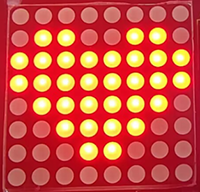

# **Project 18: Beating Heart**

### **1. Description**
In this project, a beating heart will be presented via an Arduino board, 8X8 dot matrix display, circuit board and other electronic components. By programming, you can control the beating frequency, heart dimension and its brightness. 

### **2. Wiring Diagram**


### **3. Test Code**

Alter the heart between a big one and a small one, and it starts beating. 

```C
/*
  keyestudio Nano Inventor Starter Kit
  Project 18 Beating Heart
  http://www.keyestudio.com
*/
#include <LedControl.h>  
  
int DIN = 11;     //Define DIN pin to D11
int CS =  10;     //Define CS pin to D10
int CLK = 13;     //Define CLK pin to D13
  
LedControl lc=LedControl(DIN,CLK,CS,4);  
byte neutral1[8]=   {0x00, 0x10, 0x38, 0x1c, 0x1c, 0x38, 0x10, 0x00};//a small heart   
byte neutral2[8]= {0x30, 0x78, 0x7c, 0x3e, 0x3e, 0x7c, 0x78, 0x30};//a big heart   

void setup(){  
 lc.shutdown(0,false);       //MAX72XX is in power saving mode when starting   
 lc.setIntensity(0,8);       //Set the brightness to the maximum   
 lc.clearDisplay(0);         //Clear display   
}  
  
void loop(){   
    printByte(neutral1);//Diaplay a samll heart   
    delay(1000);//Delay 1s   
    printByte(neutral2);//Display a big heart  
    delay(1000);//Delay 1s   
}  
  
//Dot matrix display function   
void printByte(byte character [])  
{  
  int i = 0;  
  for(i=0;i<8;i++)  
  {  
    lc.setRow(0,i,character[i]);  
  }  
}  
```

### **4. Test Result**

After wiring up and upload code, the two sizes of hearts are displayed alternately. 

     
