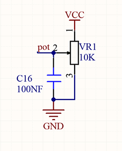
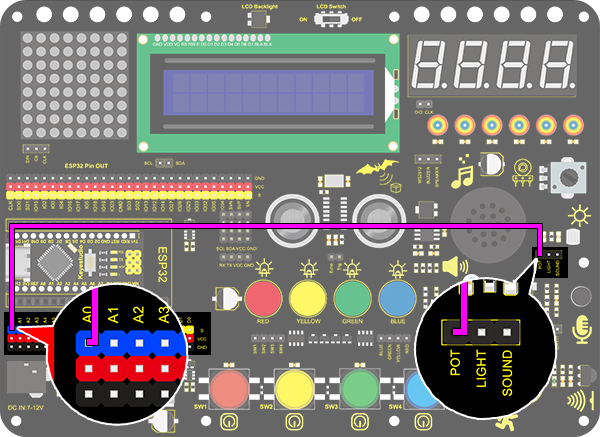
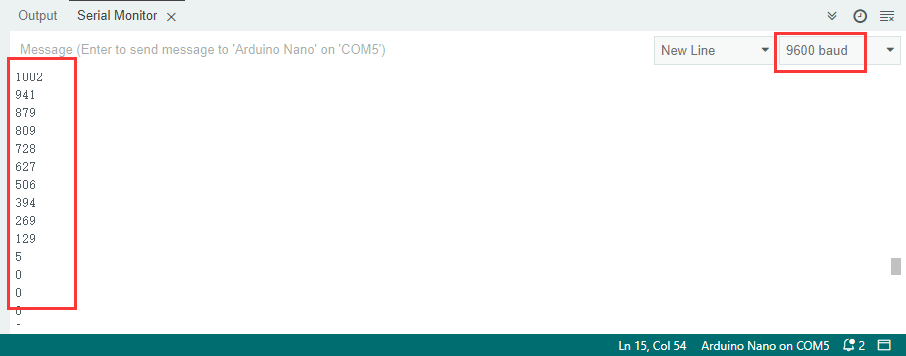

# **Project 19 : Dimming Lamp**

### **1. Description**
The dimming lamp adjusts the brightness of LED via a potentiometer and an Arduino controller. For potentiometer, the brightness is influenced by different resistance, which can be read and adjusted by connecting the meter pins to digital/analog pins on board. 
What's more, this system is applied to control voltage/current of other devices, such as fans, bulbs and heaters. 

### **2. Working Principle**



**Working Principle:** 
Essentially, potentiometer is a resistor with changeable resistance. According to Ohm's law(U=IR), the resistance affects the voltage.
In this project, the maximum resistance is 10K. The Nano board will equally divide the voltage of 5V into 1024 parts (5/1024=0.0048828125). The analog voltage is obtained by multiplying the read value and 0.004882815. 

**NOTE:** 
If you power the module by only USB, the working voltage may not reach 5V, which causes a smaller analog value. So please connect an external DC 7-12V power supply if necessary. 

### **3. Wiring Diagram**



### **4. Test Code**

Here we adopts a new function to read analog value: analogRead(Pin). Input the analog pin number connecting with the sensor into this function, and the analog value can be read. 

```c
/*
  keyestudio Nano Inventor Starter Kit
  Project 19.1 Dimming Lamp
  http://www.keyestudio.com
*/
int pot = A0;      //Define variable pot to A0
void setup() {
  // put your setup code here, run once:
  Serial.begin(9600);		// Set baud rate to 9600
}

void loop() {
  // put your main code here, to run repeatedly:
  int value = analogRead(pot);	// Read A0 and assign it to the variable value
  Serial.println(value);		//Print the variable value and wrap it around 
}
```

### **5. Test Result**

After wiring up and uploading code, open serial monitor to set baud rate to 9600, and the analog value will be displayed, within the range of 0-1023.



### **6. Expansion Code**

We control the brightness of LED via a potentiometer. 
As we know, it is influenced by PWM. However, the range of analog value is 0-1023 while that of PWM is 0-255. Hence, we need a "map(value, fromLow, fromHigh, toLow, toHigh)" function to adjust the range.

**Wiring Diagram**:


**Code:**

```c
/*
  keyestudio Nano Inventor Starter Kit
  Project 19.2 Dimming Lamp
  http://www.keyestudio.com
*/
int led = 3;		//Define LED to D3 
int pot = A0;		//Definr pot to A0 
void setup() {
  // put your setup code here, to run once:
  pinMode(led,OUTPUT);		//Set pin D3 to output 
}

void loop() {
  // put your main code here, to run repeatedly:
  int value = analogRead(pot);
  int led_val = map(value,0,1023,0,255);  //Equally-proportionally convert the range of potentiometer analog value to the range we need 
  analogWrite(led,led_val);
}
```

### **7. Code Explanation**

**analogRead(pot);** 
Read the analog value. Put the input pin of analog value in brackets. 

**map(value, fromLow, fromHigh, toLow, toHigh)** map(value,0,1023,0,255);
Convert the range of value from 0-1023 to 0-255. Because the range of value does not conform to that of PWM, a conversion is necessary. 
