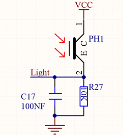
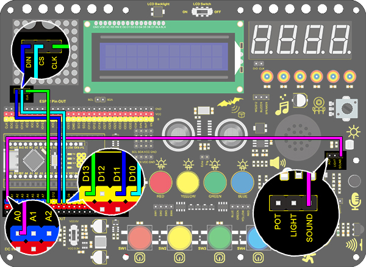

# **Project 20: Light Pillar**

### **1. Description**
The resistance(less than 1KΩ) of the photoresistor varies from the light, hence it can control the brightness of the dot matrix. When controlling, we connect this resistor with an analog pin on the board to monitor the change of resistance. In this way, the light automatically controls the brightness of the display. 

Besides, it is widely applied to our daily life. For instance, a curtain automatically opens or closes according to the outer light intensity. 

### **2. Working Principle**



**Working Principle:** 

When it is totally in dark, the resistance equals 0.2MΩ, and the voltage at signal terminal (point 2) approaches to 0V. The stronger the light is , the smaller the resistance and voltage will be.

### **3. Wiring Diagram**


### **4. Test Code**

We adopts **analogRead(Pin)** function to read the analog value. Connect the sensor to A0 pin, and the value will be printed on the serial monitor. 

```c
/*
  keyestudio Nano Inventor Starter Kit
  Project 20.1 Light Pillar
  http://www.keyestudio.com
*/
int light = A0;
void setup(){  
 Serial.begin(9600); 
}  
  
void loop(){   
  int val = analogRead(light);
  Serial.println(val);
}  
```

### **5. Test Result**

After wiring up and uploading code, open serial monitor to set baud rate to 9600, the analog value will be displayed, withing the range of 0-1023. 

### **6. Expansion Code**

In this expansion project, we use this resistor to sensing the ambient light intensity. The middle two columns are included in this experiment to represent light intensity. The lighter it is, the more the lighting LED will be. This forms a "light pillar".

**Wiring Diagram:**



**Code:**

```c
/*
  keyestudio Nano Inventor Starter Kit
  Project 20.2 Light Pillar
  http://www.keyestudio.com
*/
#include <LedControl.h>  
  
int DIN = 11;     //Defien DIN pin to D11
int CS =  10;     //Defien CS pin to D10
int CLK = 13;     //Defien CLK pin to D13
byte smile[8]=   {0x01,0x03,0x07,0x0F,0x1F,0x3F,0x7F,0xFF};//Smile face  
LedControl lc=LedControl(DIN,CLK,CS,4);  

void setup(){  
 lc.shutdown(0,false);       // MAX72XX is in power saving mode whrn starting   
 lc.setIntensity(0,1);       //Set the brightness to the maximum   
 lc.clearDisplay(0);         //Clear display  
 Serial.begin(9600); 
}  
  
void loop(){   
  int val = analogRead(A0);
  Serial.println(val);
  int temp = map(val,0,1023,0,7);
  lc.setRow(0,3,smile[temp]);
  lc.setRow(0,4,smile[temp]); 
  delay(500);//Delay 1s  
}  
```

