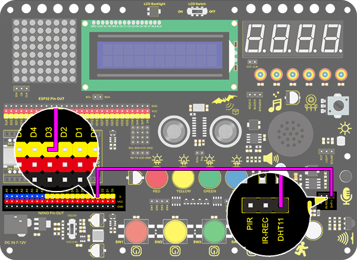
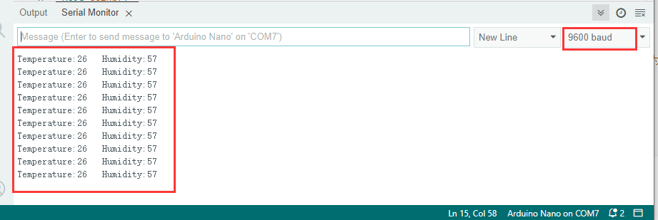
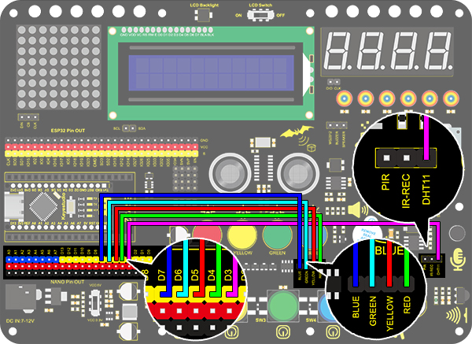

# **Project 23: Smart Cup**

### **1. Description**
In this project, we mainly adopt the Arduino development board to create a programmable smart cup, which reveals the temperature of inner liquid through a RGB indicator. By setting threshold values, the indicator will light up in different brightness levels. If the threshold is exceeded, it will get brighter. Or else, it gets darker. 

In this way, you will have a better control of the drinking water, preventing from being overheated or overcooled.

### **2. Working Principle**


### **3. Wiring Diagram**



### **4. Test Code**

Add libraries to Arduino IDE. If you skip this step, an error will occur when uploading and compiling the code.
For how to add libraries, please refer to “Development Environment Configuration”. 

```c
/*
  keyestudio Nano Inventor Starter Kit
  Project 23.1 Smart Cup
  http://www.keyestudio.com
*/
#include <dht11.h>  //include the library code
dht11 DHT;			//Define DHT example
#define DHT11_PIN 3 //Define DHT11_PIN to digital port 3
void setup()
{
  Serial.begin(9600);	//Set the baud rate to 9600
}
void loop()
{
  DHT.read(DHT11_PIN);    // Read the value of temperature on pin D3 
  Serial.print("Temperature:");   //Print "Temperature:"
  Serial.print(DHT.temperature);  //Print the temperature value
  Serial.print("   Humidity:");   //Print "   Humidity:". The space separates the two values. 
  Serial.println(DHT.humidity);   //Print the humidity value
  delay(1000);

}
```

### **5. Test Result**

After wiring up and uploading code, open serial monitor to set baud rate to 9600, and the temperature and humidity value will be displayed. 



### **6. Expansion Code**

In this expansion experiment, we will make a smart cup which can show liquid temperature. We divide 100 into four parts with an LED representing for each: 

Red LED: 75~100°C

Yellow LED: 50~75°C

Green LED: 25~50°C

Blue LED: 0~25°C

**Wiring Diagram**:



**Code:**

```c
/*
  keyestudio Nano Inventor Starter Kit
  Project 23.2 Smart Cup
  http://www.keyestudio.com
*/
#include <dht11.h>  
dht11 DHT;			//Define DHT example
#define DHT11_PIN 3 //Define DHT11_PIN to digital pin D3
int red_led =4;		//Define red_led to digital pin D4
int yellow_led = 5;	//Define yellow_led to digital pin D5
int green_led = 6;	//Define green_led to digital pin D6
int blue_led = 7; 	//Define blue_led to digital pin D7

void setup()
{
  pinMode(red_led,OUTPUT); 		//Set D4 pin to output
  pinMode(green_led,OUTPUT);	//Set D5 pin to output
  pinMode(blue_led,OUTPUT);		//Set D6 pin to output
  pinMode(yellow_led,OUTPUT);	//Set D7 pin to output
}
void loop()
{
  DHT.read(DHT11_PIN);    // Read the temperature and humidity value on pin D3
  int value = DHT.temperature;		// Assign the temperature and humidity value to the variable value
  if(value > 75){	//Determine whether value is greater than 75
    digitalWrite(green_led,LOW);
    digitalWrite(red_led,HIGH);
    digitalWrite(blue_led,LOW);
    digitalWrite(yellow_led,LOW);
  }
  if(value < 75 && value > 50){		//Determine whether value is between 50 and 75
    digitalWrite(green_led,LOW);
    digitalWrite(red_led,LOW);
    digitalWrite(blue_led,LOW);
    digitalWrite(yellow_led,HIGH);
  } 
  if(value < 50 && value > 25){		//Determine whether value is between 25 and 50
    digitalWrite(green_led,HIGH);
    digitalWrite(red_led,LOW);
    digitalWrite(blue_led,LOW);
    digitalWrite(yellow_led,LOW);
  }
  if(value < 25){					//Determine whether value is smaller than 25
    digitalWrite(green_led,LOW);
    digitalWrite(red_led,LOW);
    digitalWrite(blue_led,HIGH);
    digitalWrite(yellow_led,LOW);
  }
}
```

### **7. Code Explanation**

**#define DHT11_PIN 3** 
Macro-define a constant DHT11_PIN, which is 3 representing pin D3. Usually, a constant remains unchangeable in the code. 
Pay attention that a "macro-define" statement must not end with a semicolon. Otherwise, an error occurs. 

**DHT.read(DHT11_PIN);** 
Read the temperature and humidity value on pin DHT11_PIN. 

**DHT.temperature** 
Acquire the temperature value. 

**DHT.humidity** 
Acquire the humidity value. 

**&&** 
if(value < 100 && value > 75) means that, it is true only when both expressions satisfy the condition, or else it is false. 
