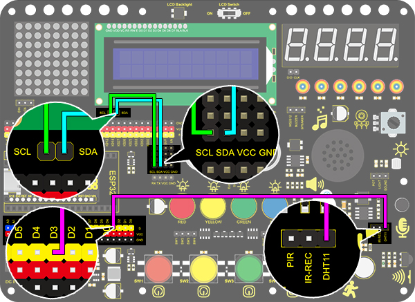
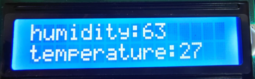

# **Project 24: Meteorological Station**

### **1. Description**
This mini meteorological station records the ambient temperature and humidity value via Arduino board and related sensors. 

Beyond that, for a more comfortable surrounding, it also automatically adjust these two values according to environmental parameters.

### **2. Wiring Diagram**



### **3. Test Code**


```c
/*
  keyestudio Nano Inventor Starter Kit
  Project 24
  http://www.keyestudio.com
*/
#include <Wire.h>
#include <LiquidCrystal_I2C.h>
#include <dht11.h>  //include the library code:

LiquidCrystal_I2C lcd(0x27,16,2); // set the LCD address to 0x27 for a 16 chars and 2 line display

dht11 DHT;
#define DHT11_PIN 3 //Define DHT11 to digital port 3

void setup()
{
 lcd.init(); // initialize the lcd
// Print a message to the LCD.
 lcd.backlight();

}
void loop()
{
  DHT.read(DHT11_PIN);    // READ DATA
  lcd.setCursor(0,0);
  lcd.print("humidity:");
  lcd.setCursor(9,0);
  lcd.print(DHT.humidity);
  lcd.setCursor(0,1);
  lcd.print("temperature:");
  lcd.setCursor(12,1);
  lcd.print(DHT.temperature);
  delay(200);
}
```

### **4. Test Result**

After wiring up and uploading code, LCD display will directly discover the ambient humidity and temperature value. 


