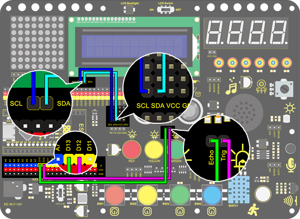

# **Project 25: Ultrasonic Diastimeter**

### **1. Description**
This ultrasonic diastimeter measures distance of obstacles by emitting sound waves and then receiving the echo. That is to say, the distance is not an immediate value, but an observed one by a theoretical calculation of time difference between emitter and receiver. 

Except distance measurement, ultrasonic is able to detect objects' forms and existence, set up automatic doors and estimate flow velocity and pressure. 

What's more, this module supports cooperative works with computers. As a result, the measured value can be transmitted to computers via Arduino board. 

In daily life, it is widely used for numerous equipment (such as motors, servo and LED) as well as systems (like automatic navigation, controlling and security monitoring systems).

### **2. Working Princple**


**Working principle:** 
As we all know, ultrasonic is a kind of inaudible sound wave signal with high frequency. Similar to a bat, this module measures distance of obstacles by calculating the time difference between wave-emitting and echo-receiving.

**Maximum distance:** 3M

**Minimum distance:** 5cm

**Detection angle:** ≤15°

### **3. Wiring Diagram**


### **4. Test Code**

According to its principle, we need a **pulseIn(pin, value)** function which is a pulse function in arduino IDE.

```c
/*
  keyestudio Nano Inventor Starter Kit
  Project 25.2 Ultrasonic Diastimeter
  http://www.keyestudio.com
*/
int distance = 0; //Define a variable to receive the distance value 
int EchoPin = 13; //Connect Echo pin to D13
int TrigPin = 12; //Connect Trig pin to D12

float checkdistance() { //Acquire the distance 
  //preserve a short low level to ensure a clear high pulse:
  digitalWrite(TrigPin, LOW);
  delayMicroseconds(2);    //Delay 2um
  // Trigger the sensor by a high pulse of 10um or longer 
  digitalWrite(TrigPin, HIGH);
  delayMicroseconds(10);		//Delay 10um
  digitalWrite(TrigPin, LOW);
  //Read the signal from the sensor: a high level pulse
  //Duration is detected from the point sending "ping" command to the time receiving echo signal (unit: um).
  float distance = pulseIn(EchoPin, HIGH) / 58.00;  //Convert into distance
  delay(10);
  return distance; //Return the distance value
}

void setup() {
  Serial.begin(9600);// Set the baud rate to 9600
  pinMode(TrigPin, OUTPUT);//Set Trig pin to output
  pinMode(EchoPin, INPUT);  //Set Echo pin to input 
}

void loop() {
  distance = checkdistance();   //Assign the read value to "distance"
  if (distance < 5 || distance >= 400) {  //Display "-1" if exceeding the detection range 
    distance = -1;
  }
 Serial.print("ditance: ");
 Serial.print(distance);
 Serial.println(" CM");
  delay(200);
}
```
### **5. Test Result**

After wiring up and uploading code, open serial monitor to set baud rate to 9600, the serial port prints the distance value. 


### **6. Expansion Code**

In this expansion project, let's make a diastimeter. 

We display characters on LCD 1602. Program to show "Keyestudio" at (3,0) and “distance:” at (0,1) followed by the distance value at (9,1). 

When the value is smaller than 100(or 10), a residue of the third(or the second) bit still exists. Therefore, an "if" judgement is necessary to determine a certain condition.

**Wiring Diagram:**



**Code:**

```C
/*
  keyestudio Nano Inventor Starter Kit
  Project 25.2 Ultrasonic Diastimeter
  http://www.keyestudio.com
*/
#include <Wire.h>
#include <LiquidCrystal_I2C.h>
LiquidCrystal_I2C lcd(0x27,16,2); // set the LCD address to 0x27 for a 16 chars and 2 line display

int distance = 0; //Define a variable to receive the diatance value 
int EchoPin = 13; //Conect Echo pin to D13
int TrigPin = 12; //Conect Trig pin to D12
float checkdistance() { //Acquire the distance 
  // preserve a short low level to ensure a clear high pulse:
  digitalWrite(TrigPin, LOW);
  delayMicroseconds(2);
  //Trigger the sensor by a high pulse of 10um or longer 
  digitalWrite(TrigPin, HIGH);
  delayMicroseconds(10);
  digitalWrite(TrigPin, LOW);
  // Read the signal from the sensor: a high level pulse
  //Duration is detected from the point sending "ping" command to the time receiving echo signal (unit: um).
  float distance = pulseIn(EchoPin, HIGH) / 58.00;  //Convert into distance
  delay(10);
  return distance;
}

void setup() {
  Serial.begin(9600);//Set the baud rate to 9600
  pinMode(TrigPin, OUTPUT);//Set Trig pin to output 
  pinMode(EchoPin, INPUT);  //Set Echopin to input 
lcd.init(); // initialize the lcd
// Print a message to the LCD.
lcd.backlight();
lcd.setCursor(3,0);
lcd.print("Keyestudio");
}

void loop() {
  distance = checkdistance();
 
  if (distance < 5 || distance >= 400) {  //Display "-1" if exceeding the detection range 
    distance = -1;
  }
  if(distance < 100 && distance > 10){     // Eliminate the third residual digit when the value drops to two digits
    lcd.setCursor(11,1);
    lcd.print(" ");
  }
  if(distance < 10){   //Eliminate the second residual digit when the value drops to one digit
    lcd.setCursor(10,1);
    lcd.print(" ");
  }
  lcd.setCursor(0,1);
  lcd.print("distance:");
  lcd.setCursor(9,1);
  lcd.print(distance);
  delay(200);
}
```

### **7. Code Explanation**

**float checkdistance()** 
Self-defining function. It greatly reduces loop() by collecting some specific codes which can be directly recalled.

**delayMicroseconds();** 
Delay function. delay()is in ms while delayMicroseconds() is in um for some precise delays. 

**pulseIn(pin, value)** 
Pulse-grabbing function. 
**pin:** the number of the Arduino pin on which you want to read the pulse. Allowed data types: int.
**value:** type of pulse to read: either HIGH or LOW. Allowed data types: int.


Please refer to offocil website for more details: 
[[pulseIn() - Arduino Reference](https://www.arduino.cc/reference/en/language/functions/advanced-io/pulsein/)]:

