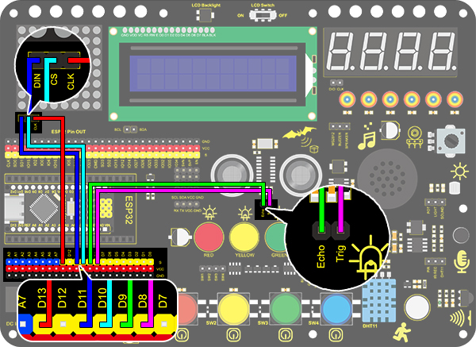

# **Project 27: Intelligent Parking**

### **1. Description**
This intelligent parking system detects and optimizes parking position via ultrasonic sensor. With this system, wrong parking is avoided to a large extent. 

Firstly, you need to install the sensor around the car-park. And then it will detect the distance between the car and its edges and send the information to the development board. After integration, the distance value will be revealed by the lines on the dot matrix display.

### **2. Flow Diagram**


### **3. Wiring Diagram**



### **4. Test Code**

When parking, we can use ultrasonic to know the situation of blind spots. In this project, lines displayed on the dot matrix indicates the distance of back of the car. 

```C
/*
  keyestudio Nano Inventor Starter Kit
  Project 27 Intelligent Parking
  http://www.keyestudio.com
*/
#include <LedControl.h>  
  
int DIN = 11;     //Define DIN pin to D11
int CS =  10;     //Define CS pin to D10
int CLK = 13;     //Define CLK pin to D13 

int temp = 0;

int distance = 0; //Define a variable to receive the distance 
int EchoPin = 9; //Connect Echo pin to D9
int TrigPin = 8; //Connect Trig pin to D8
float checkdistance() { //Acquire distance
  // preserve a short low level to ensure a clear high pulse:
  digitalWrite(TrigPin, LOW);
  delayMicroseconds(2);
  // Trigger the sensor by a high pulse of 10um or longer 
  digitalWrite(TrigPin, HIGH);
  delayMicroseconds(10);
  digitalWrite(TrigPin, LOW);
  // Read the signal from the sensor: a high level pulse
  //Duration is detected from the point sending "ping" command to the time receiving echo signal (unit: um).
  float distance = pulseIn(EchoPin, HIGH) / 58.00;  //Convert into distance
  delay(10);
  return distance;
}

LedControl lc=LedControl(DIN,CLK,CS,4);  
byte data_val[4][8]= {
  {0x00, 0x00, 0x00, 0x01, 0x01, 0x00, 0x00, 0x00},
  {0x00, 0x00, 0x04, 0x05, 0x05, 0x04, 0x00, 0x00},
  {0x00, 0x10, 0x14, 0x15, 0x15, 0x14, 0x10, 0x00},
  {0x40, 0x50, 0x54, 0x55, 0x55, 0x54, 0x50, 0x40},
  };


void setup(){  
  lc.shutdown(0,false);       //MAX72XX is in power saving mode when starting   
  lc.setIntensity(0,8);       //Set the brightness to the maximum    
  lc.clearDisplay(0);         //Clear display    

  pinMode(TrigPin, OUTPUT);//Set Trig pin to output 
  pinMode(EchoPin, INPUT);  //Set Echopin to input 
  Serial.begin(9600);
}  
  
void loop(){   
  distance = checkdistance();
  Serial.println(distance);
  if(distance < 15){
    temp = 0;
  }
  else if(distance < 30 && distance >15){
    temp = 1;
  }
  else if (distance < 40 && distance > 30){
    temp = 2;
  }
  else if(distance > 50 ){
    temp = 3;
  }
  for(int i=0;i<8;i++)  
  {  
    lc.setRow(0,i,data_val[temp][i]);  
  } 
}  
  

```

### **5. Test Result**

After wiring up and uploading code, lines displays on the dot matrix. If the detected distance is shorter than 50cm, there will be fewer lines.

 


