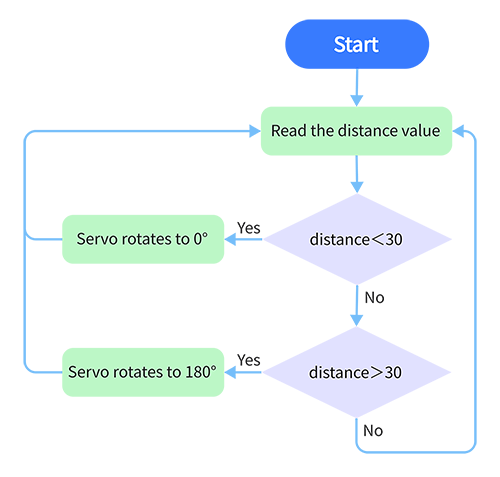

# **Project 28: Intelligent Gate**

### **1. Description**
The intelligent gate integrates MCU and ultrasonic sensor. It measures the distance of car to open or close gate handler. 

When a certain distance is reached, MCU receives the signal from the sensor and estimates the distance via the signal intensity. If the car is approaching or leaving, MCU will open or close the gate via a servo. 

### **2. Flow Diagram**

### **3. Wiring Diagram**

### **4. Test Code**

Add libraries to Arduino IDE. If you skip this step, an error will occur when uploading and compiling the code.
For how to add libraries, please refer to “Development Environment Configuration”. 

~~~C
/*
  keyestudio Nano Inventor Starter Kit
  Project 28 Intelligent Gate
  http://www.keyestudio.com
*/
#include <Servo.h>  //Servo library
Servo myservo;

int distance = 0; //Define a variable to receive the distance 
int EchoPin = 13; //Connect Echo pin to D13
int TrigPin = 12; //Connect Trig pin to D12

float checkdistance() { //Acquire distance
  // preserve a short low level to ensure a clear high pulse:
  digitalWrite(TrigPin, LOW);
  delayMicroseconds(2);
  // Trigger the sensor by a high pulse of 10um or longer 
  digitalWrite(TrigPin, HIGH);
  delayMicroseconds(10);
  digitalWrite(TrigPin, LOW);
  // Read the signal from the sensor: a high level pulse
  //Duration is detected from the point sending "ping" command to the time receiving echo signal (unit: um).
  float distance = pulseIn(EchoPin, HIGH) / 58.00;  //Convert into distance
  delay(10);
  return distance;
}

void setup() {
  myservo.attach(9);//Connect servo to digital port 9
  myservo.write(0);
  pinMode(TrigPin, OUTPUT);//set Trig pin to output 
  pinMode(EchoPin, INPUT);  //set Echo to input 
  Serial.begin(9600);
}

void loop() {
 distance = checkdistance();
 Serial.println();
  if(distance < 30){
    myservo.write(180);
    delay(5000);//Wait for 5s    
  }
  if(distance > 30){
    myservo.write(0);
  }
}
~~~

### **5. Test Result**

After wiring up and uploading code, the servo will turn to 180° and stay for 5s if the detected distance is shorter than 30cm. On the contrary, the servo will return to 0°.

