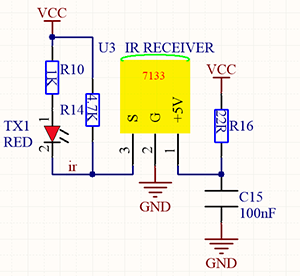
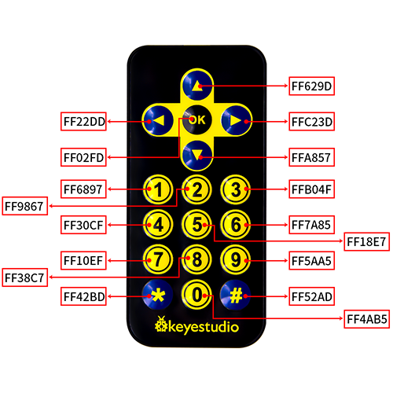
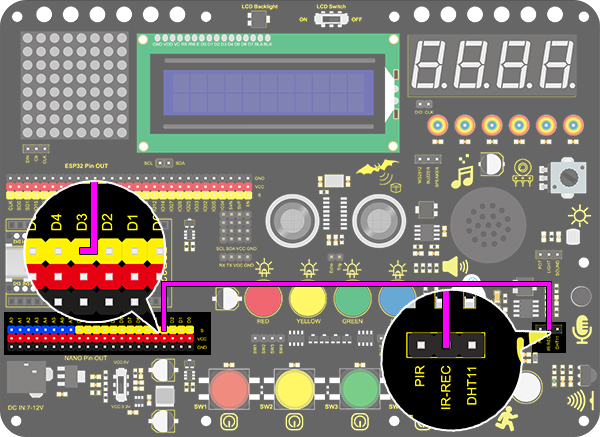
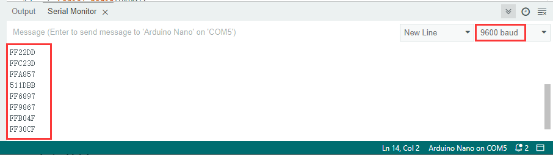
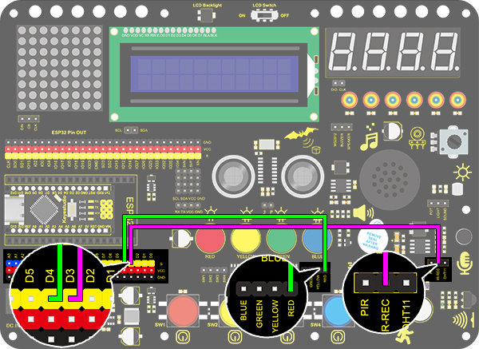

# **Project 29: IR Remote Control**

### **1. Descreption**
This module uses IR to remotely control LED, which greatly simplifies the ON and OFF of LED. Now that the control is realized by IR signals, there is no need to worry about considerable circuits. 

### **2. Working Principle**



**Working principle:** 

In actual communication, signals usually carries a wide spectrum, and a lot of energy is distributed at a low frequency band. We called it baseband signal, which is not suitable for direct transmission in channels. 

For a convenient transmission, a high anti-disturbance capability and an effective utilization of Broadband, and signals, before transmitting, always need to be modulated to a frequency which is suitable for channels and noise characteristics. This is what we called signal modulation. 

At the receiver of the communication system, signals are usually demodulated to regain the initial baseband ones. In this project, we often use a carrier of about 38K in modulation. 

An IR remote control system is mainly split into modulation, emitting and receiving. It sends data through modulating, i.e., an "and" operation between data and carriers with a certain frequency. In this way, the emitting efficiency is enhanced while power dissipation is lowered. 

Generally, the frequency of carrier modulation is within 30khz~60khz, with 38kHz more often. The duty cycle of the square wave is 1/3, as shown below, which is decided by the 455kHz crystal oscillator on the emitting end. 

An Integer frequency division is essential for crystal oscillator at this end, and the frequency coefficient usually evaluates 12. Therefore, 455kHz÷12≈37.9kHz≈38kHz. 

**38KH carrier (complete) emitting diagram:**


**Carrier frequency:** 38KHz

**Wave length:** 940nm

**Receiving angle:** 90°

**Control distance:** 6M

**Schematic diagram of remote control buttons:**



### **3. Wiring Diagram**



### **4. Test Code**

Add libraries to Arduino IDE. If you skip this step, an error will occur when uploading and compiling the code.
For how to add libraries, please refer to “Development Environment Configuration”. 


```C
/*
  keyestudio Nano Inventor Starter Kit
  Project 29.1 IR Remote Control
  http://www.keyestudio.com
*/
#include <IRremote.h> //IR remote receiving library 
long ir_rec;
IRrecv irrecv(3);
decode_results results;
void setup() {
  Serial.begin(9600);
  irrecv.enableIRIn();//Enable the IR Remote receiving 
}

void loop() {
  if (irrecv.decode(&results)) {//Receive signal 
    ir_rec = results.value; // assign the signal to the variable ir_rec
    if(ir_rec != 0){		//Prevente the code from repeating execute when the button is pressed and held ；The meaning of "!=" not equal to
    Serial.print(ir_rec, HEX); // Print the variable ir_rec in hexadecimal
    Serial.println();//wrap around to a new line
    }
    irrecv.resume();// Receive next time 
  }
}
```

### **5. Test Result**

After wiring up and uploading code, open the serial monitor and set the baud rate to 9600.  Press the button on the remote control unit, and you will see the value in hexadecimal.



### **6. Expansion Code**

In this expansion code, we will make a light controlled by an IR remote switch.  Press OK to light up the LED and press again to turn it off. This is a repeatable operation. So a reverse oprator “!” is necessary. 

**Wiring Diagram:**



**code:**

```C
/*
  keyestudio Nano Inventor Starter Kit
  Project 29.2 IR Remote Control
  http://www.keyestudio.com
*/
#include <IRremote.h> //IR remote receiving library 
boolean flag = true;//LED flag bit 
long ir_rec;
int led_val = 0;

int led = 4;
IRrecv irrecv(3);
decode_results results;
void setup() {
  Serial.begin(9600);
  pinMode(led, OUTPUT);//connect LED pin to PWM port 5
  irrecv.enableIRIn();//Enable the IR Remote receiving 
}

void loop() {
  if (irrecv.decode(&results)) {//Receive signal
    ir_rec = results.value; //assign the signal to the variable ir_rec
    if(ir_rec != 0){        //Prevente the code from repeating execute when the button is pressed and held ，The meaning of "!=" not equal to
        Serial.print(ir_rec, HEX); //Print the variable ir_rec in hexadecimal
      if(ir_rec == 0xFF02FD){       //Determine whether the received IR signal is from button OK
        led_val = !led_val;           //Reverse a variable. If the initial value is 0, it turns to 1 after reversing, and vice versa. 
        digitalWrite(led,led_val);
      }
    }
    Serial.println();//wrap around to a new line
    irrecv.resume();//Receive next time 
  }
}
```

