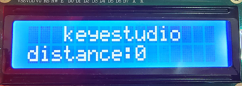

# **Project 30: Smart Home**

### **1. Description**
In this technology era, we are all familiar with smart home. It is a system that can control electric appliance via simple buttons. 

In this project, we stimulate a smart home remotely controlled by infrared sensor. With Arduino MCU as its core, it realizes intelligent control of light, air conditioner, TV and security monitors. 

All in all, this smart home system is convenient and easy to use.

### **2. Flow Diagram**


### **3. Wiring Diagram**


### **4. Test Code**

With the IR remote control, this smart home reveals various sensor values on LCD, including the value of temperature and humidity sensor, sound sensor, photosensor, potentiometer and ultrasonic sensor. 

```C
/*
  keyestudio Nano Inventor Starter Kit
  Project 30 Smart Home
  http://www.keyestudio.com
*/
#include <Wire.h>
#include <LiquidCrystal_I2C.h>
#include <IRremote.h>  //Upload IR remote receiveing library 
#include <dht11.h>     //include the library code:

LiquidCrystal_I2C lcd(0x27, 16, 2);  // set the LCD address to 0x27 for a 16 chars and 2 line display
boolean flag = true;  //LED flag bit 
long ir_rec;
long ir_val;
IRrecv irrecv(3);     //Define the IR remote contorl pin 
decode_results results;
dht11 DHT;
#define DHT11_PIN 4  //Define DHT11 to digital port 3
int distance = 0;  //Define a variable to receive the distance 
int EchoPin = 13;  //Connect Echo pin to D13
int TrigPin = 12;  //Connect Trig pin to D12
int ligth_sensor = A0;      //Define the photosensor pin 
int sound_sensor = A1;      //Define the sound sensor pin 
int pot_sensor = A2;        //Define the potentiometer sensor pin 

void setup() {
  // LCD initialization
  lcd.init();       //initialize the lcd
  lcd.backlight();  //initialize the LCD backlight 
  //LCD displays the fixed characters “keyestudio”
  lcd.setCursor(3, 0);
  lcd.print("keyestudio");
  //IR remote
  irrecv.enableIRIn();  //Enable the IR Remote receiving 
  //Set the pin mode of the ultrasonic interface 
  pinMode(TrigPin, OUTPUT);  //Set Trig pin to output 
  pinMode(EchoPin, INPUT);   //Set Echo pin to input 
}

void loop() {
  if (irrecv.decode(&results)) {  //Receive signal 
    ir_rec = results.value;       //assign the signal to the variable ir_rec
    if(ir_rec != 0){
      ir_val = ir_rec;
      show_clear();  
    }  
    irrecv.resume();              //Receive next time
  }
  switch (ir_val) {
    case 0xFF02FD: show_clear(); break;
    case 0xFF6897: show_temperature(); break;
    case 0xFF9867: show_humidity(); break;
    case 0xFFB04F: show_distance(); break;
    case 0xFF30CF: show_luminance(); break;
    case 0xFF18E7: show_sound(); break;
    case 0xFF7A85: show_pot(); break;
  }
  delay(300);
}

void show_clear() {  //Clear the display 
  lcd.setCursor(0, 1);
  lcd.print("                ");
}

void show_temperature() {  //Display Temperature value 
  int chk = DHT.read(DHT11_PIN);
  int value = DHT.temperature;
  lcd.setCursor(0, 1);
  lcd.print("Temperature:");
  lcd.setCursor(13, 1);
  lcd.print(value);
  Serial.println("1");
  if (value < 100) {
    lcd.setCursor(15, 1);
    lcd.print(" ");
  }
}

void show_humidity() {  //Display humudity value 
  int chk = DHT.read(DHT11_PIN);
  int value = DHT.humidity;
  lcd.setCursor(0, 1);
  lcd.print("Humidity:");
  lcd.setCursor(10, 1);
  lcd.print(value);
  Serial.println("2");
  if (value < 100) {
    lcd.setCursor(12, 1);
    lcd.print(" ");
  }
}

float checkdistance() {  //Acquire the distance 
  //preserve a short low level to ensure a clear high pulse
  digitalWrite(TrigPin, LOW);
  delayMicroseconds(2);
  //Trigger the sensor by a high pulse of 10um or longer 
  digitalWrite(TrigPin, HIGH);
  delayMicroseconds(10);
  digitalWrite(TrigPin, LOW);
  //Read the signal from the sensor: a high level pulse
  //Duration is detected from the point sending "ping" command to the time receiving echo signal (unit: um).
  float distance = pulseIn(EchoPin, HIGH) / 58.00;  //Convert into distance
  delay(10);
  return distance;
}

void show_distance() {  //Display the distance value 
  distance = checkdistance();
  // if (distance < 2 || distance >= 400) {  //Display "-1" if exceeding the detection range 
  //   distance = -1;
  // }
  lcd.setCursor(0, 1);
  lcd.print("distance:");
  lcd.setCursor(9, 1);
  lcd.print(distance);
  if (distance < 100 && distance > 10) {  //Eliminate the third residual digit when the value drops to two digits
    lcd.setCursor(11, 1);
    lcd.print(" ");
  }
  if (distance < 10) {  //Eliminate the second residual digit when the value drops to one digit
    lcd.setCursor(10, 1);
    lcd.print(" ");
  }
}

void show_luminance() {  //Read the analog luminance value 
  int value = analogRead(ligth_sensor);
  lcd.setCursor(0, 1);
  lcd.print("Luminance:");
  lcd.setCursor(11, 1);
  lcd.print(value);
  if (value < 1000) {
    lcd.setCursor(14, 1);
    lcd.print(" ");
  }
  if (value < 100) {
    lcd.setCursor(13, 1);
    lcd.print(" ");
  }
  if (value < 10) {
    lcd.setCursor(12, 1);
    lcd.print(" ");
  }
}

void show_sound() {  //Read the analog ambient sound value 
  int value = analogRead(sound_sensor);
  lcd.setCursor(0, 1);
  lcd.print("Sound:");
  lcd.setCursor(7, 1);
  lcd.print(value);
  if (value < 1000) {
    lcd.setCursor(10, 1);
    lcd.print(" ");
  }
  if (value < 100) {
    lcd.setCursor(9, 1);
    lcd.print(" ");
  }
  if (value < 10) {
    lcd.setCursor(8, 1);
    lcd.print(" ");
  }
}

void show_pot() {  //Read the analog potentiometer value 
  int value = analogRead(pot_sensor);
  lcd.setCursor(0, 1);
  lcd.print("PotAnalog:");
  lcd.setCursor(11, 1);
  lcd.print(value);
  if (value < 1000) {
    lcd.setCursor(14, 1);
    lcd.print(" ");
  }
  if (value < 100) {
    lcd.setCursor(13, 1);
    lcd.print(" ");
  }
  if (value < 10) {
    lcd.setCursor(12, 1);
    lcd.print(" ");
  }
}

```

### **5. Test Result**

After wiring up and uploading code, press buttons and observe the displayed contents on LCD.

Press button 1 to display temperature value.


Press button 2 to display humidity value.


Press button 3 to display distance value.



Press button 4 to display luminance value.


Press button 5 to display the analog sound volume. 


Press button 6 to display the analog potentiometer value. 


Press button OK to clear the display. 


