# Project


## **Project 1: Blinking**

###  **1. Description**

LED blinking is a simple project designed for starters. You only need to install an LED on Arduino board and upload the code on Arduino IDE. 

This project reinforces the learning of Arduino conceptual framework and using methods for starters. 

###  **2. Working Principle**


**LED lighting principle:** 

The above is the circuit diagram of LED. 

Generally speaking, limited IO ports of output current may cause enough-less brightness of LED, so NPN triode (Q2) is applied in circuit as a switch. 

In this case, the LED will light up if the base(pin 1) of triode is at a high level. On the contrary, LED goes off when the base is at low. 

**Triode switch controlling principle:** 

To have a clear understanding of its principle, certain knowledge of electronic circuit is required. For details, please consult materials by yourself. 

Briefly, LED on and off rely on the high and low levels of triode base, which are decided by the pin on the development board. LED lights up when the base(pin 1) is at a high level, and it goes off when the base is at low.


### **3. Wiring Diagram**


###  **4. Test Code**

According to previous principles, we can control LED via power levels of NANO pin. 
1. Define a variable as pin D3 used for pin number modification. 
2. Set pin D3 to output mode in setup( ). This is very important.
3. Set pin D3 to output a “HIGH” and delay for 1s. And then set pin D3 to output “LOW” and also delay for 1s.
4. As a result, LED will be on for 1s and off for another 1s in a circulation. 

```C
/*
  keyestudio Nano Inventor Starter Kit
  Project 1 Blinking
  http://www.keyestudio.com
*/
int ledPin = 3; //Define LED to connect with pin D3
void setup() {
  pinMode(ledPin, OUTPUT);//Set the mode to output
}

void loop() {
  digitalWrite(ledPin, HIGH); //Output a high level, LED lights up.
  delay(1000);//Delay 1000ms
  digitalWrite(ledPin, LOW); //Output a low level, LED goes off.
  delay(1000);

}

```

###  **5. Test Result**

After uploading the code and powering on, LED will blink alternatively with on for 1s and off for 1s.

### **6. Code Explanation**

**setup()Function** 
It is used to initialize variables and pin modes and to enable the library. setup()Function runs once only after each time the board powering on or being reset. 

**loop()Function** 
Followed by setup(), loop()function perpetually executes its code, such as read the pin or output the pin. 

**int ledPin = 3** 
“int” is a variable within range of -32768 ~ 32767. 
This example code means we define a variable **ledpin** with an assignment of 3. Therefore, we adopt **ledpin** rather than “3” in later steps, which largely simplifies experimental recordings when considerable sensors and pins are included. 

**pinMode(pin,mode)** 
"pin" is the pin number of mode setting. And the “mode” is optional for INPUT, OUTPUT, and INPUT_PULLUP. 
Here we set pin 3 to output mode. 

**digitalWrite(pin, value)** 
“pin” is the digital tube pin of MCU, and here we define as pin 3. “value” is the digital output of power level (HIGH/LOW). If we apply pinMode() to set pin to OUTPUT, its voltage should be modified correspondingly. For instance, 5V (3.3V if on a 3.3V-board) corresponds to HIGH, while 0V (GND) is for LOW.
However, if LED links with the pin rather than setting pinMode() to OUTPUT, LED may become dim when recalling digitalWrite(HIGH). This is because digitalWrite() enables the inner pull-up resistor, whose function is similar to a great current-limiting resistor. 

**delay(ms)** 
It is a delay function and “ms” is the delay time in micro seconds. 


For more Arduino grammar explanation, please refer to: 

[https://www.arduino.cc/reference/en/](https://www.arduino.cc/reference/en/)


## **Project 2: Breathing Light**

### **1. Description**
Arduino breathing light utilizes on-board programmable PWM to output analog waveform. After powering on, LED brightness can be adjusted through duty cycle of the waveform to eventually realize a breathing light. 

In this way, ambient light can be simulated by changing LED brightness along with time. Also, breathing light can form a colorful mini light show to construct a tranquil and warm environment.

### **2. PWM Working Principle**
PWM controls analog output via digital means, which are able to adjust the duty cycle of the wave (a signal circularly shifting between high level and low level).

For Arduino, digital ports of voltage output are LOW and HIGH, which respectively correspond to 0V and 5V. 

Generally, we define LOW as 0 and HIGH as 1. Arduino will output 500 signals of 0 or 1 within 1s. If they are 500 "1", 5V will be output. Oppositely, if they are all 0, the output will be 0V. Or if they are 010101010101..., the average output will be 2.5V. In other words, output ratio of 0 and 1 affects the voltage value. Honestly, it differs from real continuous output, yet the more 0 and 1 signals are output per unit time, the more accurate the control will be. 


### **3. Wiring Diagram**


### **4. Test Code**

We adopt "**for**" statement to increase a variable from 0 to 255, and we define the variable as PWM output (**analogWrite(pin, value)**). By the way, a delay time may reinforce the control of LED shining time. Next, we use another "for" statement to decrease it from 255 to 0 with also a delay time to control LED dimming process. 

As a result, a breathing light is complete. 

```C
/*
  keyestudio Nano Inventor Starter Kit
  Project 2 Star Breathing Light
  http://www.keyestudio.com
*/
int ledPin = 3; // Define LED as digital port 3
void setup () {
  pinMode (ledPin, OUTPUT); // Initialize LED to output mode
}
void loop () {
  for (int i = 0; i < 255; i++) {	//for loop statement
    analogWrite (ledPin, i); //led gradually lights up
    delay (10); // Delay 10ms
  }
  for (int i = 0; i < 255; i--) {
    analogWrite (ledPin, i); // led gradually goes off
    delay (10); // Delay 10ms
  }
}
```

### **5. Test Result**
After uploading the code, we can see the LED dims gradually rather than all of a sudden. It "breathes" evenly.

### **6. Code Explanation**

**for (int i = 0; i <= 255; i ++){ ... }** 
The variable changes from 0 to 255. 
**i++** means i automatically add 1 for each time until it fails to meet the condition of i <= 255. Otherwise, the code will execute in a loop for a total of 256 times. 

**for (int i = 255; i >= 0; i --){ ... }**
Similarly, **i- -** indicates i circularly reduce 1 for each time until it dissatisfies i>= 0. 

**analogWrite (Pin, value)** 
It is a function of pin analog output value. **Pin** is a PWM interface, and **value** is the output PWM value within range of 0~255.

But why does this analog value output on a digital pin?
Because we control the brightness of LED via PWM whose interfaces on the development board include digital ports D3, D5, D6, D9, D10 and D11. That is to say, LED is controlled only when signal terminal connects to one of these interfaces. 

In this experiment, we connect signal terminal to D3 pin. And we set up the range of 0~255 and a condition that, the less PWM is, the dimmer LED will be. 

Let's back to this code. We set PWM value of D3 to i, which gradually add 1 for each time from 0 to 255. A 10ms delay occurs after each increase, and LED slowly becomes brighter. 
However, when PWM equals 255, i starts to decrease one by one from 255 to 0 also with a 10ms delay for each time. Then LED becomes dimmer. 
Finally LED alternates between bright and dim, just like breathing.

If you want to cut its alternative duration, you can modify the code "delay()" in for()loop. The shorter the delay time is, the shorter the duration time will be. 

**i++** 
i automatically add 1 for each loop. 


For details, please refer to:
[https://www.arduino.cc/reference/en/]( https://www.arduino.cc/reference/en/)

## **Project 3：SOS Distress Device**

### **1. Description**
Arduino SOS device is able to emit distress signals, which coincide with the principle of Morse code. It is convenient for emergencies.

### **2. Wiring Diagram**


### **3. Test Code**

What we should clear firstly is how SOS distress light blinks: LED quickly blinks three times for “S” and slowly blinks three times for “O”. And then, we control the blinking times and duration via "for" statement and set interval time among letters. 

```C
/*
  keyestudio Nano Inventor Starter Kit
  Project 3 SOS Distress Device
  http://www.keyestudio.com
*/
int ledPin = 3;  //Define led to pin 3
 
void setup() {
pinMode(ledPin, OUTPUT);
}
 
void loop() {
// Three quick blinks mean an “S”
for(int x=0;x<3;x++){
digitalWrite(ledPin,HIGH);            //Set LED to light up
delay(150);                           //Delay 150ms
digitalWrite(ledPin,LOW);             //Set LED to turn off
delay(100);                           //Delay 100ms
}
 
//delay 200ms to generate the space between letters
delay(200);
 
//Three slow blinks mean an “O”
for(int x=0;x<3;x++){
digitalWrite(ledPin,HIGH);            //Set LED to light up
delay(400);                           //Delay 400ms
digitalWrite(ledPin,LOW);             //Set LED to turn off
delay(200);                           //Delay 200ms
}
 
//Delay 100ms to generate the space between letters
delay(100);
 
// Three quick blinks mean an “S”
for(int x=0;x<3;x++){
digitalWrite(ledPin,HIGH);            //Set LED to light up
delay(150);                           //Delay 150ms
digitalWrite(ledPin,LOW);             //Set LEDms
delay(100);                           //Delay 100ms
} 
// Wait 5s before repeating "S.0.S"
delay(5000);
}
```

### **4. Test Result**

After uploading the code, LED respectively blinks for 3 times in the sequence of quick, slow and quick, which forms "S.O.S". It repeats after 5s. 


## **Project 4: Traffic Light**

### **1. Description**
The traffic light module limits the pedestrian and vehicular thoroughfare. It includes a red, a yellow and a green light, which imply different instructions.

**Red for Stop:** Pedestrians and vehicles stop proceeding.

**Yellow for Caution:** Pedestrians and vehicles are ready for stopping. If the drive is already in process, the speed should be slow. 

**Green for Proceed:** Pedestrians and vehicles keep going with the abidance of traffic regulations. 

In this project, you can program to control a mini traffic light. For instance, set the duration of each lights and the interval time among them. 

Besides, you may also add a timer to alter light colors to schedule. 

### **2. Wiring Diagram**


### **3. Test Code**

We simply stimulate the traffic light: green LED lights up for 5s, yellow LED blinks for 3 times, and red LED lights up for 5s. And we set this to loop. 

The blinking of yellow LED can utilize for()statement we have mentioned in project 3. Thus, we now only need to set the lighting time to complete a traffic light. 

```C
/*
  keyestudio Nano Inventor Starter Kit
  Project 4 Traffic Light
  http://www.keyestudio.com
*/
int greenPin = 4;   //Green LED connects to digital pin D4
int yellowPin = 3; //Yellow LED connects to digital pin D3
int redPin = 2;   //Red LED connects to digital pin D2
void setup() {
  //Set all LED interfaces to output mode
  pinMode(greenPin, OUTPUT);
  pinMode(yellowPin, OUTPUT);
  pinMode(redPin, OUTPUT);
}

void loop() {
  digitalWrite(greenPin, HIGH); //Light green LED up
  delay(5000);  //Delay 5s
  digitalWrite(greenPin, LOW); //Turn green LED off
  for (int i = 1; i <= 3; i++) {  //Execute for 3 times
    digitalWrite(yellowPin, HIGH); //Light yellow LED up
    delay(500); //Delay 0.5s
    digitalWrite(yellowPin, LOW); //Turn yellow LED off
    delay(500); //Delay 0.5s
  }
  digitalWrite(redPin, HIGH); //Light red LED up
  delay(5000);  //Delay 5s
  digitalWrite(redPin, LOW); //Turn red LED off

}
```

### **4. Test Result**

After uploading the code, green LED will light up for 5s, yellow LED will blink for 3 times, and red LED will light up for also 5s, in circulation. 

## **Project 5：Rainbow Ambient Light**

### **1. Description**
Arduino 2812RGB LED is a programable colorful dreamy light, whose lighting color, brightness and rhythm are adjustable. This rainbow ambient light can used as a dynamic decoration at will. Or you may control it to "dance with music".

Importantly, it can be improved as an alarm. Its built-in sensor detects the ambient surroundings to warn users by changing lighting colors, brightness and rhythm.

### **2. Working Principle**


**Working Principle:** 

The data protocol adopts communication mode of single-line RTZ code. 

After powering on and pixel resetting, DIN terminal receives data from the controller. The firstly arriving 24bit data will be extracted by the first pixel and be sent to the inner data register. 

Remaining data will be amplified by an amplification circuit and be transmitted through DOUT port to the next cascaded pixel. 
Being transmitted through pixels, the signal decreases 24bit each time. 

Besides, the automatic amplification and transmitting technology offer unlimited number of cascade from signal transmitting, yet it is limited by transmitting speed. 

### **3. Wiring Diagram**

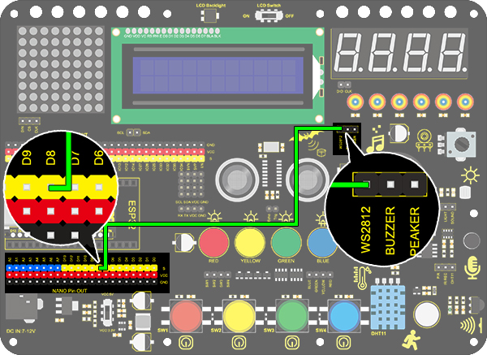

### **4. Test Code**

Before uploading the code, please ensure the library file is loaded to arduino IDE. Otherwise, an error may occur. 
Many codes in the library can be directly recalled. 

```C
/*
  keyestudio Nano Inventor Starter Kit
  Project 5  Rainbow Ambient Light
  http://www.keyestudio.com
*/
//Add 2812RGB library file
#include <NeoPixel.h>
Adafruit_NeoPixel  rgb_display(8);  //Define a class of pixels

void setup() {
  rgb_display.begin();  //Activate 6812RGB
  rgb_display.setPin(8);  //Set 2812 pin to digital port 8
  rgb_display.setBrightness(100); //Set the brightness to 100, within the range of 0~255
}

void loop() {
  rgb_display.setPixelColor(0, 255, 0, 0); //The frist pixel color is red
  rgb_display.setPixelColor(1, 0, 255, 0); //The second pixel color is green
  rgb_display.setPixelColor(2, 0, 0, 255); //The third pixel color is blue
  rgb_display.setPixelColor(3, 255, 255, 0); //The fourth pixel color is yellow
  rgb_display.setPixelColor(4, 255, 0, 255); //The fifth pixel color is purple
  rgb_display.setPixelColor(5, 255, 255, 255); //The sixth pixel color is white
  rgb_display.show(); //Display the pixel color
  delay(100);

}
```

### **5. Test Result**

After uploading code, wiring up and powering on, the LED will light up in different colors.


### **6. Expansion Code**

Code for a mini light show as follows. Specifically, we replace RGB value with variables. And then we control these variables to form an expected light show. 

**The wiring remain unchanged.**

**Code:**

```C
/*
  keyestudio Nano Inventor Starter Kit
  Project 5.2  Rainbow Ambient Light
  http://www.keyestudio.com
//Add 2812RGB library file
*/
#include <NeoPixel.h>
#ifdef __AVR__
#include <avr/power.h>
#endif

#define PIN 8

// Parameter 1 = number of pixels in strip
// Parameter 2 = Arduino pin number (most are valid)
// Parameter 3 = pixel type flags, add together as needed:
//   NEO_KHZ800  800 KHz bitstream (most NeoPixel products w/WS2812 LEDs)
//   NEO_KHZ400  400 KHz (classic 'v1' (not v2) FLORA pixels, WS2811 drivers)
//   NEO_GRB     Pixels are wired for GRB bitstream (most NeoPixel products)
//   NEO_RGB     Pixels are wired for RGB bitstream (v1 FLORA pixels, not v2)
Adafruit_NeoPixel strip = Adafruit_NeoPixel(6, PIN, NEO_GRB + NEO_KHZ800);

// IMPORTANT: To reduce NeoPixel burnout risk, add 1000 uF capacitor across pixel power leads, add 300 - 500 Ohm resistor on first pixel's data input and minimize distance between Arduino and first pixel.  Avoid connecting on a live circuit...if you must, connect GND first.

void setup() {
  // This is for Trinket 5V 16MHz, you can remove these three lines if you are not using a Trinket
  #if defined (__AVR_ATtiny85__)
    if (F_CPU == 16000000) clock_prescale_set(clock_div_1);
  #endif
  // End of trinket special code


  strip.begin();
  strip.show(); // Initialize all pixels to 'off'
}

void loop() {
  // Some example procedures showing how to display to the pixels:
  colorWipe(strip.Color(255, 0, 0), 50); // Red
  colorWipe(strip.Color(0, 255, 0), 50); // Green
  colorWipe(strip.Color(0, 0, 255), 50); // Blue
  // Send a theater pixel chase in...
  theaterChase(strip.Color(127, 127, 127), 50); // White
  theaterChase(strip.Color(127, 0, 0), 50); // Red
  theaterChase(strip.Color(0, 0, 127), 50); // Blue

  rainbow(20);
  rainbowCycle(20);
  theaterChaseRainbow(50);
}

// Fill the dots one after the other with a color
void colorWipe(uint32_t c, uint8_t wait) {
  for(uint16_t i=0; i<strip.numPixels(); i++) {
    strip.setPixelColor(i, c);
    strip.show();
    delay(wait);
  }
}

void rainbow(uint8_t wait) {
  uint16_t i, j;

  for(j=0; j<256; j++) {
    for(i=0; i<strip.numPixels(); i++) {
      strip.setPixelColor(i, Wheel((i+j) & 255));
    }
    strip.show();
    delay(wait);
  }
}

// Slightly different, this makes the rainbow equally distributed throughout
void rainbowCycle(uint8_t wait) {
  uint16_t i, j;

  for(j=0; j<256*5; j++) { // 5 cycles of all colors on wheel
    for(i=0; i< strip.numPixels(); i++) {
      strip.setPixelColor(i, Wheel(((i * 256 / strip.numPixels()) + j) & 255));
    }
    strip.show();
    delay(wait);
  }
}

//Theatre-style crawling lights.
void theaterChase(uint32_t c, uint8_t wait) {
  for (int j=0; j<10; j++) {  //do 10 cycles of chasing
    for (int q=0; q < 3; q++) {
      for (int i=0; i < strip.numPixels(); i=i+3) {
        strip.setPixelColor(i+q, c);    //turn every third pixel on
      }
      strip.show();

      delay(wait);

      for (int i=0; i < strip.numPixels(); i=i+3) {
        strip.setPixelColor(i+q, 0);        //turn every third pixel off
      }
    }
  }
}

//Theatre-style crawling lights with rainbow effect
void theaterChaseRainbow(uint8_t wait) {
  for (int j=0; j < 256; j++) {     // cycle all 256 colors in the wheel
    for (int q=0; q < 3; q++) {
      for (int i=0; i < strip.numPixels(); i=i+3) {
        strip.setPixelColor(i+q, Wheel( (i+j) % 255));    //turn every third pixel on
      }
      strip.show();

      delay(wait);

      for (int i=0; i < strip.numPixels(); i=i+3) {
        strip.setPixelColor(i+q, 0);        //turn every third pixel off
      }
    }
  }
}

// Input a value 0 to 255 to get a color value. The colours are a transition r - g - b - and tback to r.
uint32_t Wheel(byte WheelPos) {
  WheelPos = 255 - WheelPos;
  if(WheelPos < 85) {
    return strip.Color(255 - WheelPos * 3, 0, WheelPos * 3);
  }
  if(WheelPos < 170) {
    WheelPos -= 85;
    return strip.Color(0, WheelPos * 3, 255 - WheelPos * 3);
  }
  WheelPos -= 170;
  return strip.Color(WheelPos * 3, 255 - WheelPos * 3, 0);
}
```

### **6. Code Explanation**

**#include <Adafruit_NeoPixel.h>** 
Libraries are included, so that codes in library can be directly recalled. 

**Adafruit_NeoPixel  rgb_display(6);** 
Set the number of employed 2812 RGB. Here we input 6.

**rgb_display.begin();** 
Initialize 2812RGB. This is essential. 

**rgb_display.setPin(8);** 
Set the connected pin of 2812RGB. This is also necessary. 

**rgb_display.setBrightness(100);** 
Set the brightness of 2812RGB within range of 0~255. The greater the value is, the brighter the LED will be. 
The default brightness value is 255, which is also the brightest. 

**rgb_display.setPixelColor(uint16_t n, uint8_t r, uint8_t g, uint8_t b);** 
rgb_display.setPixelColor(pixel number, red, green, blue): Set the pixel number of 2812RGB and the color value of each LED.


**rgb_display.show();** 
Display 2812RGB. It is this important statement that refreshes the display of LED.

## **Project 6：Water Flow Light**

### **1. Description**
This simple water flow light project guides you in electronic packaging. In this project, we control LED to shift the color in a specified speed. 

### **2. Wiring Diagram**


### **3. Test Code**

A water flow light consists of a stream of LED lighting from left to right and vice versa. 

In this experiment, we use continuous pins, so that "for" statement can be utilized not only to set output mode (we replace pins with circular variable in code) but also to output. 


```C
/*
  keyestudio Nano Inventor Starter Kit
  Project 6 Water Flow Light
  http://www.keyestudio.com
*/
void setup() {
  for(int i = 3;i <= 6 ;i++){   //"for" loop statement, set D3-D6 pin to output mode
    pinMode(i,OUTPUT);
  }
}

void loop() {
  for(int i = 3; i <= 6; i++){		//Use for loop statement to light up LED on D3-D6 pin in sequence
    digitalWrite(i,HIGH);
    delay(200);
    digitalWrite(i,LOW);
  }
  for(int i = 6; i >= 3; i--){		//Use for loop statement to light up LED on D6-D3 pin in sequence
    digitalWrite(i,HIGH);
    delay(200);
    digitalWrite(i,LOW);
  }
}
```

### **4. Test Result**

After uploading code and powering on, the stream of LED light up from left to right and vice versa in a loop.


### **5. Code Explanation**

**for(int i = 3;i <= 6 ;i++){    pinMode(i,OUTPUT);    }** 
We use "for" statement to define continuous pins. Yet it features a disadvantage of non-replacement ability of pins, which deteriorates the code portability. 

**for(int i = 3; i <= 6; i++){
    		digitalWrite(i,HIGH);
    		delay(200);
    		digitalWrite(i,LOW);
  }** 

In the first loop, LED on D3 pin will light up and will be off after a 200ms delay. At the second time, LED on D4 pin will turn on and will turn off also after a 200ms delay. By that analogy, the execution will be out of the loop when LED on D6 pin goes off. 

Similarly, another "for" loop shares the common principle. The only difference is LED lighting from D6 to D3. 
## **Project 7：Buzzer**

### **1. Description**
An active buzzer can function as an alarm, a reminder or an entertaining device. It provides reliable voice warning for you.  What's more, it stimulates various sounds and features high controllability, so that you can experience an interesting and real experiment. 

### **2. Working Principle**


**Working Principle:** 

An active buzzer integrates a multi-vibrator, so it makes sound only by a DC voltage. 

Pin 1 of the buzzer connects to VCC and pin 2 is controlled by a triode.  When a high level is provided for the base (pin 1) of the triode, its collector (pin 3) and emitter (pin 2) link to GND, and then the buzzer emits sound.  Oppositely, if we offer a low level to the base, the rest of pins will be disconnected, so the buzzer will remain quiet.

### **3. Wiring Diagram**


### **4. Test Code**

If the development board outputs a high level, the buzzer will emit sound. If it outputs a low level, the buzzer will stop ringing. 
Thus, its code is similar to light up an LED.

```C
/*
  keyestudio Nano Inventor Starter Kit
  Project 7 Buzzer
  http://www.keyestudio.com
*/
int buzzer = 3; //Define buzzer connecting to D3 pin
void setup() {
  pinMode(buzzer, OUTPUT);//Set the output mode
}

void loop() {
  digitalWrite(buzzer, HIGH); //D3 pin outputs a high level to cause the buzzer to emit sound
  delay(1000);	//Delay 1000ms
  digitalWrite(buzzer, LOW); //D3 pin outputs a low level to prevent the buzzer to emit sound
  delay(1000);
}
```

### **5. Test Result**

After uploading code and powering on, the buzzer emits sound for 1s and stays quiet for another 1s, in circulation. 


## **Project 8：Music Performer**

### **1. Description**
This project realizes a music player with an amplifier on the development board. This speaker can not only play simple songs, but also perform music made by yourself. Thus, you can program other interesting codes in the project to accomplish splendid learning outcomes.

### **2. Working Principle**


**Working principle:** 

The electrical signal is input from pin 1 of RP1 (adjusts signal intensity, which is also the sound volume). After coupling in C4 and passing R5, the signal reaches IN- pin of 8002B, in which it is operationally amplified and output to BEE1 speaker. 


**Frequency Comparison Table in C**

|    Note     | Frequency(Hz) |      Note      | Frequency(Hz) |     Note     | Frequency(Hz) |
| :---------: | :-----------: | :------------: | :-----------: | :----------: | :-----------: |
| Flat  1  Do |      262      | Natural  1  Do |      523      | Sharp  1  Do |     1047      |
| Flat  2  Re |      294      | Natural  2  Re |      587      | Sharp  2  Re |     1175      |
| Flat  3  Mi |      330      | Natural  3  Mi |      659      | Sharp  3  Mi |     1319      |
| Flat  4  Fa |      349      | Natural  4  Fa |      698      | Sharp  4  Fa |     1397      |
| Flat  5  So |      392      | Natural  5  So |      784      | Sharp  5  So |     1568      |
| Flat  6  La |      440      | Natural  6  La |      880      | Sharp  6  La |     1760      |
| Flat  7  Si |      494      | Natural  7  Si |      988      | Sharp  7  Si |     1967      |

### **3. Wiring Diagram**


### **4. Test Code**

According to the comparison table, we set a pin to output mode. And we use function "**tong(Pin , frequency);**" to generate square waves in certain frequency to emit corresponding sound. Finally, the notes will be output after adding a delay time.

```C
/*
  keyestudio Nano Inventor Starter Kit
  Project 8.1 Music Performer
  http://www.keyestudio.com
*/
int beeppin = 6; //Define the speaker pin to D6
void setup() {
  pinMode(beeppin, OUTPUT);//Define the amplifier digital port to output mode
}

void loop() {
  tone(beeppin, 262);//Flat DO plays 500ms
  delay(500);
  tone(beeppin, 294);//Flat Re plays 500ms
  delay(500);
  tone(beeppin, 330);//Flat Mi plays 500ms
  delay(500);
  tone(beeppin, 349);//Flat Fa plays 500ms
  delay(500);
  tone(beeppin, 392);//Flat So plays 500ms
  delay(500);
  tone(beeppin, 440);//Flat La plays 500ms
  delay(500);
  tone(beeppin, 494);//Flat Si plays 500ms
  delay(500);
  noTone(beeppin);//Stop for 1s
  delay(1000);
}
```

### **5. Test Result**

After uploading code and powering on, the amplifier circularly plays music tones with corresponding frequency: DO, Re, Mi, Fa, So, La, Si.

### **6. Expansion Code**

For a little more complicated, let's play a birthday song.

**The wiring remains unchanged.**

**Numbered musical notation:**


**Comparison Diagram of Flat, Natural and Sharp**


**Code:**

~~~C
/*
  keyestudio Nano Inventor Starter Kit
  Project 8.2 Music Performer
  http://www.keyestudio.com
*/
int beeppin = 6; //Define the speaker pin to D6 do、re、mi、fa、so、la、si
int doremi[] = {262, 294, 330, 370, 392, 440, 494,      //Falt 0-6
                523, 587, 659, 698, 784, 880, 988,      //Natural 7-13
                1047,1175,1319,1397,1568,1760,1967};    //Sharp 14-20
int happybirthday[] = {5,5,6,5,8,7,5,5,6,5,9,8,5,5,12,10,8,7,6,11,11,10,8,9,8};   // Find the number in arrey doremi[] according to the numbered musical notation
int meter[] = {1,1,2,2,2,4, 1,1,2,2,2,4, 1,1,2,2,2,2,2, 1,1,2,2,2,4};    // Beats

void setup() {
  pinMode(beeppin, OUTPUT); //Set beeppin to output mode
}

void loop() {
  for( int i = 0 ; i <= 24 ;i++){       //i<=24, because there are only 24 tones in this song
    //Use tone()function to generate a waveform in "frequency"
   tone(beeppin, doremi[happybirthday[i] - 1]);
   delay(meter[i] * 200); //Wait for 1000ms
   noTone(beeppin);//Stop singing
  }
}

~~~

###  **7. Code Explanation**

**doremi[]{ … };**
Linear array is used to store data, which generally are considered as a series of variables of the same type. 
Analogically, data are neatly put in ordered boxes, so that we can take the sequenced numbers to use corresponding data.

**tone(pin, frequency)；** 
"pin" is the arduino pin generating tones in a total of 6 pins.  "frequency" is the note frequency in the unit of Hz. 

**unsigned int** is the data type within range of 0 ~ 65, 535 ((2^16) - 1).

1. "tone" function controls the module to generate square waves in certain frequency(duty cycle of 50％). It sings until "noTone()" (Stop to sing) is activated. 
2. Tones can be emitted by connecting the pin to a piezoelectric buzzer or other speakers. 
3. For each time, tone() generates only one type of tone. Thus, if a tone is played on some pin, this function will be invalid. 
4. tone()function disturbs the PWM output on pin 3 and pin 11 (on any board excluding Mega). 
5. The sound frequency generated by tone() must be no less than 31Hz. So when you play tones in different frequency on numerous pins, noTone() is necessary on one pin and followed by tone() on next pin.

**noTone(beeppin);** stops the tone generation(stops singing). You can directly add the pin number in it. 

## **Project 9：Digital Tube Display**

### **1. Description**
This display module, whose display range includes 0 ~ 9 and simple letters, consists of four digital tubes with seven LED on each and can be used as a counter or a clock.

Moreover, multiple functions can be realized by connecting their pins to the development board, such as timekeeping and some game storing. 

### **2. Working Principle**


TM1650 utilizes IIC protocol and adopts two bus lines (SDA and SCL).

**Data Command:** 0x48.  This command directs TM1650 to light up the digital tubes rather than key scanning.

**Display Command:**


Actually, it is one byte of data with different bits representing different functions.
**bit[6:4]:** Set the brightness of LED. Note that 000 indicates the brightest. 
**bit[3]:** Determine whether there is a decimal dot. 
**bit[0]:** Determine whether to turn on the display.

**Digital Tube Turns on**
Take an example: Level 8 brightness without a dot signifies 0x05. 
Steps: Starting signal — Send 0x48 — Slave-device receives — Send 0x05 — Slave-device receives — Ending signal
After turning on, there is no need to repeatedly send 0x48, as the function of digital tube has confirmed. 
Besides, the brightness and display methods can be enumerated with multiple data in one place, so that it is clear and space-saving.

**Digital Tube Turns off**
Steps: Starting signal — Send 0x48 — Slave-device receives — Send 0x00 — Slave-device receives — Ending signal

**Digital Tube Displays Numbers**
We firstly direct TM1650 to display numbers on the predetermined tube. 
And then the number will be displayed. Its eight bit corresponds to eight segment, with 1 for lighting up and 0 for lighting out. 
If there is a doubt of the corresponding relation, you may light up bit by bit in loop.

For example, when bit 1 is turned on and displays 8, the data is 0x68. If there is a dot, 8 will also be displayed when sending 0x7f.
Steps: Starting signal — Send 0x68 — Slave-device receives — Send 0x7f — Slave-device receives — Ending signal
Result: 8 is displayed on Bit 1. 

For convenience, an array of corresponding value to 0~9 can be made. After further improvement, it is able to display numbers, adjust brightness, shift the decimal dot and tubes.

### **3. Wiring Diagram**


### **4. Test Code**

Upload library files on Arduino IDE. If you skip this step, an error will occur when uploading and compiling codes. 

For how to add libraries, please refer to “Development Environment Configuration”.

**Code:**

```C
/*
  keyestudio Nano Inventor Starter Kit
  Project 9.1 Digital Tube Display 
  http://www.keyestudio.com
*/
#include "KETM1650.h" //Upload TM1650 library files
KETM1650 tm_4display(A5,A4);  //Define tm_4display example and set pin interfaces to A5 and A4

void setup(){
  tm_4display.init(); //Initialization 
  tm_4display.setBrightness(3); //Set the brightness to 3 (within the range of 1~8)
}

void loop(){
    tm_4display.displayString(9999);//Digital tube displays 9999
}
```

### **5. Test Result**

After wiring up and uploading code, the digital tube display shows "9999", as shown below. 


### **6. Expansion Code**

Let's have some difficult operations. Rather than static numbers, we handle it to show some dynamic ones.  The following code manipulates the tubes to display 1~9999 by "for" loop.

**The wiring remains unchanged.**

**Code:**

```c
/*
  keyestudio Nano Inventor Starter Kit 
  Project 9.2 Digital Tube Display 
  http://www.keyestudio.com
*/
#include "KETM1650.h" //Upload TM1650 library files
KETM1650 tm_4display(A5,A4);  //Define tm_4display example and set pin interfaces to A5 and A4

void setup(){
  tm_4display.init(); //Initialization 
  tm_4display.setBrightness(3); //Set the brightness to 3 (within the range of 1~8)
}

void loop(){

  for(int i = 0 ; int <= 9999 ; i++){
    tm_4display.displayString(i);//Digital tube displays i
    delay(100); //Delay 100ms
  }
}
```

### **7. Code Explanation**

**.init();** 
Initialize TM1650.

**.clear();** 
Clear the display. 

**.displayString(char * aString);**
Display character string. *aString indicates the contents of the character string to aString.

**.displayString(String sString);** 
Display character string. sString is the character string.

**.displayString(float value);** 
Display decimals in the format of float.

**.displayString(double value);** 
Display decimals in the format of double.

**.displayString(int value);** 
Display integers in the format of int.

**.displayOn();** 
Turn on the digital tube display. 

**.displayOff();** 
Turn off the digital tube display. Differed from ".clear", once it turns off, reuse **.displayOn();** to redisplay. 

**.setDot(unsigned int aPos, bool aState);** 
Display decimal dot. aPos represents the position of the dot(0~3 is 1~4). aState means the display state, 1(true) for lighting up, and 2(false) for lighting out. 

**.setBrightness(unsigned int iBrightness);** 
Set the brightness of LED. "iBrightness" is the level of brightness(1~8) in "unsigned int". A maximum or minimum is automatically set if the brightness value is out of range.


For more details, please refer to the code annotations and explanations. 
## **Project 10：Dot Matrix Display**

### **1. Description**
This module consists of a 8x8 LED dot matrix with one control pin for each row as well as each column to adjust the brightness of LED. 

Connecting with Arduino board, the brightness of LED is controlled via programs. In this way, simple characters and figures are able to be displayed. It also can be applied in game machines or screens.

### **2. Working Principle**

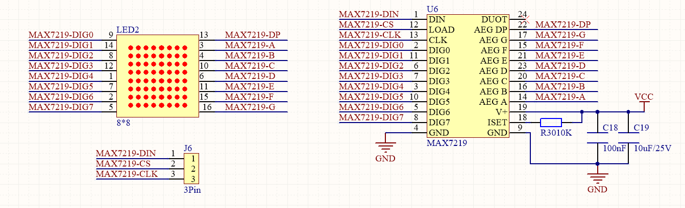

**Working Principle:** 
MAX7219 is an IC with SPI communication and controls 8x8 dot matrix. The MAX7219 SPI communication has integrated in our libraries and you can recall directly.

### **3. Dot Matrix Modulo Operation**

Click the link for Modulo: [http://dotmatrixtool.com/#](http://dotmatrixtool.com/#)

**Operating process:** 
1.Click the link and set the height and width of the dot matrix. Here we set both to 8. 


2.Set "Byte Order" to "Column Major".


3.Set "Endian" to "Big Endian (MSB)".


4.Click the white tiles to form a pattern you want(click again to be deselected), and then click "Generate" to generate an array for this icon. Copy this array and paste it in code, and then the pattern will be displayed on the dot matrix.


### **4. Wiring Diagram**


### **5. Test Code**

Add libraries to Arduino IDE. If you skip this step, an error will occur when uploading and compiling the code. For how to add libraries, please refer to “Development Environment Configuration”. 

```c
/*
  keyestudio Nano Inventor Starter Kit
  Project 10 Dot Matrix Display
  http://www.keyestudio.com
*/
#include <LedControl.h>  
  
int DIN = 11;     //Define DIN pin to D11
int CS =  10;     //Define CS pin to D10
int CLK = 13;     //Define CLK pin to D13
  
LedControl lc = LedControl(DIN,CLK,CS,4); //Upload DIN, CS, CLK pin to library
byte neutral[8]= {0x30, 0x78, 0x7c, 0x3e, 0x3e, 0x7c, 0x78, 0x30};//Data of the heart

void setup(){  
 lc.shutdown(0,false);       //When powering on, MAX72XX is in power saving mode. 
 lc.setIntensity(0,8);       //Set the brightness to the maximum
 lc.clearDisplay(0);         //Clear the display 
}  
  
void loop(){   
    printByte(neutral);//Diaplay a heart
}  
  
//Dot Matrix Display Function
void printByte(byte character [])  
{  
  int i = 0;  
  for(i=0;i<8;i++)  
  {  
    lc.setRow(0,7-i,character[i]);  	
  }  
}  
```

### **6. Test Result**

After wiring up and uploading code, a heart will be displayed on the dot matrix, as shown below.

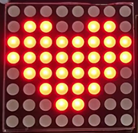

### **7. Code Explanation**

**lc.shutdown(0,false);** 
Select the state of power saving mode, with false for exiting and true for entering. It will not display anything if entering this mode.

**lc.setIntensity(0,8);** 
Set the range of brightness intensity to level 0-8, among which 8 is the brightest.

**lc.clearDisplay(0);** 
Clear the pattern displayed on the dot matrix. 

**void printByte(byte character [ ]){ … }** 
User-defined function. It package the required "for" statement. In this way, we can directly use this function when a loop()function is needed. 
## **Project 11: LCD**

### **1. Description**
Arduino I2C 1602 LCD is a commonly-used auxiliary device for MCU development board to connect with external sensors and modules. It features a 16-bit wide character and 2-line LCD screen, whose brightness is adjustable. 

This programmable module is convenient for data editing, displaying and managing. Besides, it can display not only characters and figures but sensors value, like temperature, humidity or pressure value. 

As a result of its usability, the display is wildly applied in many fields, including smart home, industrial monitoring system, robot control and automatics' electronics.

### **2. Working Principle**


**Working Principle:** 
It is the same as IIC communication principle. Underlying functions have packaged in libraries so that you can recall them directly. 
If you are interested in these, you may have a further look of underlying driving principles. 

### **3. Wiring Diagram**


### **4. Test Code**

Add libraries to Arduino IDE. If you skip this step, an error will occur when uploading and compiling the code.

For how to add libraries, please refer to “Development Environment Configuration”. 

```c
/*
  keyestudio Nano Inventor Starter Kit
  Project 11 LCD
  http://www.keyestudio.com
*/
#include <Wire.h>
#include <LiquidCrystal_I2C.h>
LiquidCrystal_I2C lcd(0x27,16,2); // set the LCD address to 0x27 for a 16 chars and 2 line display
void setup()
{
lcd.init(); // initialize the lcd
// Print a message to the LCD.
lcd.backlight();		//Turn on the LCD backlight
lcd.setCursor(2,0);		//Set the display position
lcd.print("Hello,world!");		//LCD displays "Hello, world!"
lcd.setCursor(2,1);	
lcd.print("keyestudio!");		//LCD displays "keyestudio!"
}
void loop()
{
}
```


### **5. Test Result**

After wiring up and uploading code, turn on the LCD, and "Hello, world!" and "keyestudio!" will displayed on the LCD. 

If the characters are unclear, please fix the backlight potentiometer by the small slotted screwdriver(included in this kit). Connect an external power supply if necessary.

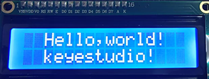


### **6. Code Explanation**

**#include <LiquidCrystal_I2C.h>**	
"#include" is a "include" command of libraries, so we can recall functions in file.h (programs in library).

**LiquidCrystal_I2C lcd(0x27,16,2);** 
Define an LCD. 0x27 is its IIC address, and 16 means the number of columns(display 16 characters in total), and 2 is the number of rows.

**lcd.init();** 
Initialize LCD. 

**lcd.backlight();** 
Turn on LCD backlight, which clarifies the displayed characters. 

**lcd.setCursor(3,0);** 
Set the display position. (3,0) indicates the starting position is in the fourth column and first row.

**lcd.print("Hello, world!");** 
Define the displayed characters. Enclose the strings in quotation marks, for instance, lcd.print("Hello, world!"). The marks can be omitted if displaying one value, for example, lcd.print(value). 

## **Project 12: Servo**

### **1. Description**
This servo features high performance and high precision with a maximum rotation angle of 180°. Weighting only 9g with a tiny size, it is perfectly suitable for any mini devices in any occasion. 

What's more, it enjoys short startup time, low noise and strong stability.

### **2. Working Principle**
**Angle Scale:** 180° (commonly 360°, 180° and 90°)

**Drive Voltage:** 3.3V / 5V

**Pin:** Three-wire


**GND:** Grounded, in brown

**VCC:** power supply pin connecting to +5v/3.3V, in red

**S:** Signal pin controlling PWM signal, in orange

(1).png)

**Control Principle**: 

The rotation angle is controlled via duty cycle of PWM. 

Theoretically, standard PWM cycle is 20ms(50Hz), so pulse width should distribute within 1ms~2ms. However, the actual pulse width reaches 0.5ms~2.5ms, corresponding to 0°～180°. 

Pay attention that, for the same signal, the rotation angle vary from servo brands. 

### **3. Wiring Diagram**

.jpg)

### **4. Test Code**

Add libraries to Arduino IDE. If you skip this step, an error will occur when uploading and compiling the code.
For how to add libraries, please refer to “Development Environment Configuration”. 

```C
/*
  keyestudio Nano Inventor Starter Kit
  Project 12 Servo
  http://www.keyestudio.com
*/
#include <Servo.h>  //Servo library
Servo myservo;
void setup() {
  myservo.attach(9);//Set the control pin of servo to D9
}

void loop() {
  for (int pos = 0; pos < 180; pos++) {  //Control the servo to rotate from 0° to 180° by "for"loop.
    myservo.write(pos); //Rotate to angle of pos
    delay(15);  //Add a delay to slow the rotation
  }
  for (int pos = 180; pos > 0; pos--) {		//Control the servo to rotate from 180° to 0° by "for"loop.
    myservo.write(pos);
    delay(15);
  }
  delay(2000);//Wait 2s
}
```

### **5. Test Result**

After wiring up and uploading code, the servo starts to rotate from 0° to 180° and vice versa. 

### **6. Code Explanation**

**Servo myservo;**  Define an example of myservo

**myservo.attach(9);** Set the control pin of the servo

**myservo.write(pos);**  Set the rotation angle of the servo
## **Project 13: Mini Lamp**

### **1. Description**
In this project, we control a lamp by Arduino Nano and a button. When we press the button, the state of the lamp will shift (ON or OFF).

### **2. Working Principle**


**Working Principle:** 
When the button is released, a voltage VCC passing through R29 provides a high level for S terminal. 
When it is pressed, pin 1 and 3, pin 2 and 4 are connected and voltage on S1 arrives GND as a low level. At this moment, R29 avoids a short circuit between VCC and GND.

### **3. Wiring Diagram**

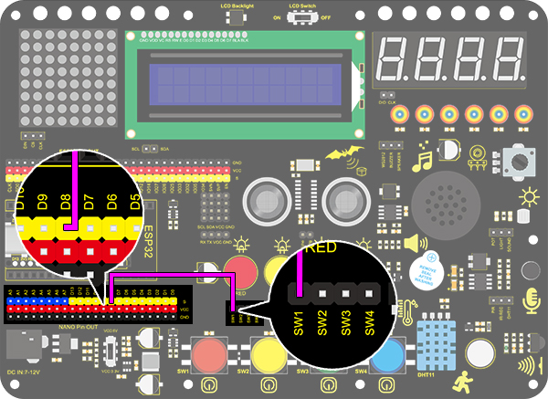

### **4. Test Code**

Now that voltage is low when pressing the button, we can read the pin voltage value via "digitalRead(Pin)", 1 for high and 0 for low.

```C
/*
  keyestudio Nano Inventor Starter Kit
  Project 13.1 Mini Lamp
  http://www.keyestudio.com
*/
int button = 8;
int value = 0;
void setup() {
  Serial.begin(9600); //Set the serial baud rate to 9600
  pinMode(button, INPUT);  //Connect the button pin to digital port 8 and set it to output mode.
}

void loop() {
  value = digitalRead(button);//Read the button value
  Serial.print("Key status:"); //Print "Key status:" on serial port
  Serial.println(value); //Print the button variable on the serial port and convert
}
```

### **5. Test Result**

After wiring up and uploading code, open the serial monitor and set the baud rate to 9600. 

When we press the button, serial port prints "Key status: 0"; When we release the button, serial port prints "Key status: 1".


### **6. Expansion Code**

**Flow Diagram:**


**Wiring Diagram:**


**Code:**

Make a mini lamp by a button and an LED. 

```C
/*
  keyestudio Nano Inventor Starter Kit
  Project 13.2 Mini Lamp
  http://www.keyestudio.com
*/
int button = 8;  //Define the variable button to pin D8
int LED = 3;	//Define LED to pin D3
int led_val = 0;
void setup() {
  pinMode(button, INPUT);  //Connect the button pin to digital port 8 and set it to the input mode
  pinMode(LED, OUTPUT);  //Connect LED pin to digital port 3 and set it to output mode
}

void loop() {
  int button_val = digitalRead(button);//Read the D8 pin button value
  if (button_val == 0) {  //Determine whether the button value equals 0
    led_val = !led_val;   //'!' takes the inverse sign, if it is 1, it becomes 0 or 0 becomes 1
    digitalWrite(LED, led_val); //Turn on LED or LED off
    while(!digitalRead(button)); //Preventing the inability to turn on the LED light due to prolonged button pressing
  }
}
```

### **7. Code Explanation**

**pinMode(8, INPUT);** 
Set pin D8 on the development board to input, so that the state of button can be identified. When we press the button, D8 is at a low level(0). If we release it, D8 will be at high(1).

**button = digitalRead(8);** 
digitalRead(8) identifies the power level on digital pin D8, and assigns the read value (0 or 1) to button variable.

**Serial.begin(9600);** 
Set the serial baud rate. It is necessary to print value on serial port.

**Serial.print("Key status:");** 
Serial port prints value. Contents in print() will be printed. If it is character string, quotation marks are needed, for instance, "Key status:".

**Serial.println(button);** 
Wrap characters around. Serial port prints contents in println() in a new line. Here we print the button value.

**if (button == 0) { ... }** 
“if“ condition command. Determine whether button value equals 0. If it does, execute the code in “if{...}“; Otherwise, no execution.

**==** 
Determine whether values on the two sides of "==" equal.


Official Website: [https://www.arduino.cc/reference/en/](https://www.arduino.cc/reference/en/)


## **Project 14: Counter**

### **1. Description**
Arduino 4-bit digital tube counter can record numbers within 0~9999. It features display speed and counting mode adjustment as well as resetting function.  This module is wildly applied in real-time counter (such as button-press and DC motor rotation count), gaming and experiment equipment.

### **2. Flow Diagram**


### **3. Wiring Diagram**


### **4. Test Code**

At least, a counter includes three buttons: plus, minus, and reset(return to zero). 
We program "if" to determine the state of button, "pressed" for execution. For better results, we need to add a 200ms delay. 

```C
/*
  keyestudio Nano Inventor Starter Kit
  Project 14 Counter
  http://www.keyestudio.com
*/
#include "KETM1650.h" //Upload TM1650 library files
int item = 0; //Displayed value
KETM1650 tm_4display(A5,A4);  //The interfaces of two wires are A5 nd A4

int res = 3;     //Reset button
int subtract = 4;   //minus button
int  add = 5;       //plus button

void setup(){
    //set the pin connecting with button to input 
  pinMode(res,INPUT);
  pinMode(add,INPUT);
  pinMode(subtract,INPUT);
  tm_4display.init(); //Initialize the digital tubes. 
  tm_4display.setBrightness(3); //Set the brightness(range of 1~8) to 3
}

void loop(){
  tm_4display.displayString(item);//Digital tube displays item value
  int red_key = digitalRead(res);            // Red button is the reset button
  int yellow_key = digitalRead(subtract);    // Yellow button is minus 1
  int green_key = digitalRead(add);           // Green button is plus 1
  if(green_key == 0){
    item++;  //operate to add 1, item = item + 1
    delay(200);
  }
   if(yellow_key == 0){
    item--;		//operate to reduce 1, item = item - 1
    delay(200);
  }
   if(red_key == 0){
    item = 0;
    delay(200);
  }
  if (item > 9999) {  //return to zero when greater than 9999(excessing the display range) 
    item = 0; 
  }
}
```

### **5. Test Result**

After wiring up and uploading code, press green button to add 1, yellow to minus 1, and red to reset.  Press the button and hold, and the displayed value will keep adding or substracting.

## **Project 15: Responder**

### **1. Description**
This programable responder inputs and receives signals through Arduino development board and a group of buttons, and it judges the correctness of answers by an LED.

Responders exercise students' reaction ability and draw their attention to questions. If the answer is correct, the respondent obtains a lot scores. 

Moreover, it simplifies teachers' manipulation of question-grabbers and cuts answer clutters. It may even stimulate students' interests in learning. 

### **2. Flow Diagram**


### **3. Wiring Diagram**


### **4. Test Code**

Imagine a question-master and three respondents. 

Respondents are allowed to grab questions only when the master presses the red button. Otherwise, their replies are invalid and lights are all off. Plus, if one of the three presses his/her button, the remaining two buttons are also invalid. 

```C
/*
  keyestudio Nano Inventor Starter Kit
  Project 15 Responder
  http://www.keyestudio.com
*/
int blue_key = 3;	//Set blue button to pin D3
int  green_key= 4;	//Set green button to pin D4
int yellow_key = 5;	//Set yellow button to pin D5
int red_key = 6;	//Set red button to pin D6

int blue_led = 7;	//Set blue LED to pin D7
int green_led = 8;	//Set green LED to pin D8
int yellow_led = 9;	//Set yellow LED to pin D9
int red_led = 10;	//Set red LED to pin D10

void setup(){
    //Set the pin connecting with button to input
  pinMode(blue_key,INPUT);	
  pinMode(green_key,INPUT);
  pinMode(yellow_key,INPUT);
  pinMode(red_key,INPUT);
 	//Set the pin connecting with button to output
  pinMode(blue_led,OUTPUT);
  pinMode(green_led,OUTPUT);
  pinMode(yellow_led,OUTPUT);
  pinMode(red_led,OUTPUT);

}

void loop(){
  int red_key_val = digitalRead(red_key);	//Read the red button value 
  digitalWrite(red_led,HIGH);				//Red LED lights up
  if(red_key_val == 0){				//Determine whether the red button is pressed
    digitalWrite(red_led,LOW);		//All LED go off
    digitalWrite(blue_led,LOW);
    digitalWrite(green_led,LOW);
    digitalWrite(yellow_led,LOW);
    delay(200);
    while(1){						//while()loop
      int blue_key_val = digitalRead(blue_key);		//Read the button value 
      int green_key_val = digitalRead(green_key);
      int yellow_key_val = digitalRead(yellow_key);
      if(blue_key_val == 0){						//Determine whether the blue button is pressed
        digitalWrite(blue_led,HIGH);				//Blue LED lights up
        break;										//Exit loop
      }
      if(green_key_val == 0){
        digitalWrite(green_led,HIGH);
        break;
      }
      if(yellow_key_val == 0){
        digitalWrite(yellow_led,HIGH);
        break;
      }
    }
  }
}
```

### **5. Test Result**

Wire up and upload the code. 

The answers of respondents are only valid when the red LED is off(red button is pressed). 

When someone presses his/her button(yellow, green or blue), the appropriate LED as well as the red counterpart lights up. By now, rest of LED cannot turn on when pressing buttons. The responding action can be performed only when the red button is pressed again. 

### **6. Code Explanation**

**while(1) { ... }** 
Unlimited loop function. 
When the expression or value in while() is True, the execution circulates in while{}. On the contrary, the loop quits when it is False. 
In this example, "1" in while(1) represents True, so code is on a loop when entering "while", which is endless. 

For how to exit, we need a "break" statement.

**break;** 
It is used to exit a loop. In our code, this statement breaks the "while" loop. 

## **Project 16: Timebomb**

### **1. Description**

This project will give you an opportunity experience an interesting timebomb game.  

In this project, the dot matrix represents your timebomb, while the digital tube displays remaining time. Buttons can not only control the bomb but also set its time. You may set a countdown to control this bomb, and it explodes when the countdown is over. Beyond that, a buzzer is adopted to alarm. 

Anyhow, by programming on multiple sensors, your comprehensive capability of logic thinking can be enhanced. 

### **2. Flow Diagram**


### **3. Wiring Diagram**


### **4. Test Code**

When mentioning a timebomb, we think of a timer and an activate button. 
In this project, however, it is an analog bomb, so we also need a reset button. We set blue for plus, green for minus, yellow for counting down and red for resetting. 
The time (unit: s) is displayed on digital tube and 8x8 dot matrix shows the state of bomb (smile for safe and cry for explosive).

```C
/*
  keyestudio Nano Inventor Starter Kit
  Project 16 Timebomb
  http://www.keyestudio.com
*/
#include "KETM1650.h" //Upload TM1650 libraries
#include <LedControl.h>
//Dot matrix
int DIN = 11;     //Define DIN pin to D11
int CS =  10;     //Define CS pin to D10
int CLK = 13;     //Define CLK pin to D13

byte smile[8]=   {0x20,0x44,0x22,0x02,0x02,0x22,0x44,0x20};//Smile face  
byte weep[8]= {0x20,0x42,0x24,0x04,0x04,0x24,0x42,0x20};//Crying face

LedControl lc=LedControl(DIN,CLK,CS,4);  

// Button, buzzer and digital tube 
int item = 0; //the displayed value 
KETM1650 tm_4display(A5,A4);  //Set the interface to A5 and A4

int addition = 3;		//Set the plus button to D3
int subtraction = 4;	//Set the minus button to D4
int start = 5;			//Set the start button to D5
int reset = 6;			//Set the reset button to D6
int buzz = 2;			//Set the buzzer to D2

int buzz_val = 1;		//The variable of buzzer

void printByte(byte character [])  // The dot matrix display function
{  
  int i = 0;  
  for(i=0;i<8;i++)  
  {  
    lc.setRow(0,i,character[i]);  
  }  
} 

void setup(){
  lc.shutdown(0,false);       //MAX72XX is in power saving mode when starting   
  lc.setIntensity(0,8);       //Set the brightness to the maximum   
  lc.clearDisplay(0);         //Clear the display   
 //Set the pins mode  
  pinMode(addition,INPUT);		
  pinMode(subtraction,INPUT);
  pinMode(start,INPUT);
  pinMode(reset,INPUT);
  pinMode(buzz,OUTPUT);
  tm_4display.init(); // Initialization 
  tm_4display.setBrightness(3); //Set the brightness to 3, within the range of 1~8
}

void loop(){
  printByte(smile);		//Dot matrix displays a smile face 
  tm_4display.displayString(item);//Digital tube displays the item value 
  int blue_key = digitalRead(addition);		//Read the button value 
  int green_key = digitalRead(subtraction);
  int yellow_key = digitalRead(start);
  if(blue_key == 0){	//Determine whether the button is pressed 
    item = item + 1;  	// +1
    delay(200);
  }
  if(green_key == 0 ){
    item = item - 1;  // -1
    delay(200);
  }
  
  if (item > 9999) {  //When the value is greater than 9999(exceeding the display range), reset
    item = 0; 
  }
  if(yellow_key == 0){
    while(1){					//whlie()loop
      tm_4display.displayString(item);//Digital tube displays the item value
      item--;					//"item--" equals to "item = item - 1"
      delay(1000);
      buzz_val = !buzz_val;		//“！”, NOT gate. invert buzz_val
      digitalWrite(buzz,buzz_val);
      if(item == 0){
        digitalWrite(buzz,LOW);
        break;					//break the loop 
      
      }
    }
    while(item==0){				//when itme=0, enter loop 
      tm_4display.displayString(item);//Digital tube displays the item value
      printByte(weep);					//Display a crying face
      int red_key = digitalRead(reset);
      if(red_key == 0){
        break;
      }
    }
  }

}
```

### **5. Test Result**

After wiring up and uploading code, press blue button to add time, green to reduce and red to reset. Press yellow button for counting down. When it is over, the bomb explodes. 


## **Project 17: Invasion Alarm**

### **1. Description**
This simple invasion alarm detects invaders in houses or small offices and warns the host to take measures in time. 

In this project, the sensor monitors a certain area. Some device on Arduino board will trigger LED to light up and buzzer to beep for caution if a movement is detected in that zone. 

Virtually, this module features practicability, simple-ness and low costs. With the exception of home and office, it also applies to factories, warehouses and markets, which, to a large extent, protects property security.

### **2. Working Principle**

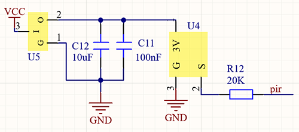

**Working Principle:** 
Human body(37°C) always emits infrared ray with a wavelength of 10μm or so, which approximates to that of the sensor detected. 
On this account, this module is able to detects human beings movement. If there is, PIR sensor outputs a high level about 3s . If not, it outputs a low level . 

### **3. Wiring Diagram**


### **4. Test Code**

From the working principle, we read power level of the sensor pin to judge whether there is a human being. 

```c
/*
  keyestudio Nano Inventor Starter Kit
  Project 17.1 Invasion Alarm
  http://www.keyestudio.com
*/
int pir = 4;    //Define D4 pin to PIR sensor pin
void setup() {
  Serial.begin(9600);
  pinMode(pir,INPUT);   //Set D4 pin to input
}

void loop() {
  int pir_val = digitalRead(pir); 	//Read the PIR result and assign it to pir_val
    Serial.print("pir_val:"); //Print “pir_val”
	Serial.println(pir_val);
    delay(500);
}
```

### **5. Test Result**

After wiring up and upload code, open serial monitor to set baud rate to 9600, and the serial port prints the PIR value.


### **6. Expansion Code**

In this expansion project, let's make an invasion alarm.  When the PIR sensor detects human, LED lights out and the buzzer emits sound. By contrast, LED goes off and the buzzer stays quiet. 

**Flow Diagram**:


**Wiring Diagram**:


**Code:**

To fulfil an invasion alarm, an "if() else" statement is necessary. 

```c
/*
  keyestudio Nano Inventor Starter Kit
  Project 17.2 Invasion Alarm
  http://www.keyestudio.com
*/
int pir = 4;		//Set PIR sensor pin to D4
int red_led = 5;	//Set red LED to pin D5
int buzz = 6;		//Set buzzer to pin D6
void setup() {
  // put your setup code here, to run once:
  pinMode(pir,INPUT);		//Set PIR pin to input mode 
  pinMode(red_led,OUTPUT);	//Set LED pin to output mode 
  pinMode(buzz,OUTPUT);		//Set buzzer pin to output mode 
}

void loop() {
  // put your main code here, to run repeatedly:
  int pir_val = digitalRead(pir);
  if(pir_val == 1){
    digitalWrite(red_led,HIGH);
    digitalWrite(buzz,HIGH);
  }
  else{
    digitalWrite(red_led,LOW);
    digitalWrite(buzz,LOW);
  }
}
```


## **Project 18: Beating Heart**

### **1. Description**
In this project, a beating heart will be presented via an Arduino board, 8X8 dot matrix display, circuit board and other electronic components. By programming, you can control the beating frequency, heart dimension and its brightness. 

### **2. Wiring Diagram**


### **3. Test Code**

Alter the heart between a big one and a small one, and it starts beating. 

```C
/*
  keyestudio Nano Inventor Starter Kit
  Project 18 Beating Heart
  http://www.keyestudio.com
*/
#include <LedControl.h>  
  
int DIN = 11;     //Define DIN pin to D11
int CS =  10;     //Define CS pin to D10
int CLK = 13;     //Define CLK pin to D13
  
LedControl lc=LedControl(DIN,CLK,CS,4);  
byte neutral1[8]=   {0x00, 0x10, 0x38, 0x1c, 0x1c, 0x38, 0x10, 0x00};//a small heart   
byte neutral2[8]= {0x30, 0x78, 0x7c, 0x3e, 0x3e, 0x7c, 0x78, 0x30};//a big heart   

void setup(){  
 lc.shutdown(0,false);       //MAX72XX is in power saving mode when starting   
 lc.setIntensity(0,8);       //Set the brightness to the maximum   
 lc.clearDisplay(0);         //Clear display   
}  
  
void loop(){   
    printByte(neutral1);//Diaplay a samll heart   
    delay(1000);//Delay 1s   
    printByte(neutral2);//Display a big heart  
    delay(1000);//Delay 1s   
}  
  
//Dot matrix display function   
void printByte(byte character [])  
{  
  int i = 0;  
  for(i=0;i<8;i++)  
  {  
    lc.setRow(0,i,character[i]);  
  }  
}  
```

### **4. Test Result**

After wiring up and upload code, the two sizes of hearts are displayed alternately. 

     
## **Project 19 : Dimming Lamp**

### **1. Description**
The dimming lamp adjusts the brightness of LED via a potentiometer and an Arduino controller. For potentiometer, the brightness is influenced by different resistance, which can be read and adjusted by connecting the meter pins to digital/analog pins on board. 
What's more, this system is applied to control voltage/current of other devices, such as fans, bulbs and heaters. 

### **2. Working Principle**

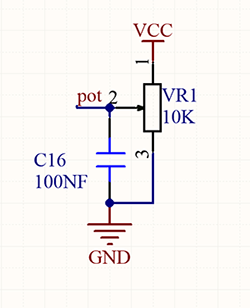

**Working Principle:** 
Essentially, potentiometer is a resistor with changeable resistance. According to Ohm's law(U=IR), the resistance affects the voltage.
In this project, the maximum resistance is 10K. The Nano board will equally divide the voltage of 5V into 1024 parts (5/1024=0.0048828125). The analog voltage is obtained by multiplying the read value and 0.004882815. 

**NOTE:** 
If you power the module by only USB, the working voltage may not reach 5V, which causes a smaller analog value. So please connect an external DC 7-12V power supply if necessary. 

### **3. Wiring Diagram**


### **4. Test Code**

Here we adopts a new function to read analog value: analogRead(Pin). Input the analog pin number connecting with the sensor into this function, and the analog value can be read. 

```c
/*
  keyestudio Nano Inventor Starter Kit
  Project 19.1 Dimming Lamp
  http://www.keyestudio.com
*/
int pot = A0;      //Define variable pot to A0
void setup() {
  // put your setup code here, run once:
  Serial.begin(9600);		// Set baud rate to 9600
}

void loop() {
  // put your main code here, to run repeatedly:
  int value = analogRead(pot);	// Read A0 and assign it to the variable value
  Serial.println(value);		//Print the variable value and wrap it around 
}
```

### **5. Test Result**

After wiring up and uploading code, open serial monitor to set baud rate to 9600, and the analog value will be displayed, within the range of 0-1023.


### **6. Expansion Code**

We control the brightness of LED via a potentiometer. 
As we know, it is influenced by PWM. However, the range of analog value is 0-1023 while that of PWM is 0-255. Hence, we need a "map(value, fromLow, fromHigh, toLow, toHigh)" function to adjust the range.

**Wiring Diagram**:


**Code:**

```c
/*
  keyestudio Nano Inventor Starter Kit
  Project 19.2 Dimming Lamp
  http://www.keyestudio.com
*/
int led = 3;		//Define LED to D3 
int pot = A0;		//Definr pot to A0 
void setup() {
  // put your setup code here, to run once:
  pinMode(led,OUTPUT);		//Set pin D3 to output 
}

void loop() {
  // put your main code here, to run repeatedly:
  int value = analogRead(pot);
  int led_val = map(value,0,1023,0,255);  //Equally-proportionally convert the range of potentiometer analog value to the range we need 
  analogWrite(led,led_val);
}
```

### **7. Code Explanation**

**analogRead(pot);** 
Read the analog value. Put the input pin of analog value in brackets. 

**map(value, fromLow, fromHigh, toLow, toHigh)** map(value,0,1023,0,255);
Convert the range of value from 0-1023 to 0-255. Because the range of value does not conform to that of PWM, a conversion is necessary. 
## **Project 20: Light Pillar**

### **1. Description**
The resistance(less than 1KΩ) of the photoresistor varies from the light, hence it can control the brightness of the dot matrix. When controlling, we connect this resistor with an analog pin on the board to monitor the change of resistance. In this way, the light automatically controls the brightness of the display. 

Besides, it is widely applied to our daily life. For instance, a curtain automatically opens or closes according to the outer light intensity. 

### **2. Working Principle**

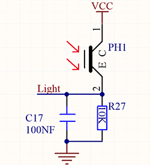

**Working Principle:** 

When it is totally in dark, the resistance equals 0.2MΩ, and the voltage at signal terminal (point 2) approaches to 0V. The stronger the light is , the smaller the resistance and voltage will be.

### **3. Wiring Diagram**


### **4. Test Code**

We adopts **analogRead(Pin)** function to read the analog value. Connect the sensor to A0 pin, and the value will be printed on the serial monitor. 

```c
/*
  keyestudio Nano Inventor Starter Kit
  Project 20.1 Light Pillar
  http://www.keyestudio.com
*/
int light = A0;
void setup(){  
 Serial.begin(9600); 
}  
  
void loop(){   
  int val = analogRead(light);
  Serial.println(val);
}  
```

### **5. Test Result**

After wiring up and uploading code, open serial monitor to set baud rate to 9600, the analog value will be displayed, withing the range of 0-1023. 

### **6. Expansion Code**

In this expansion project, we use this resistor to sensing the ambient light intensity. The middle two columns are included in this experiment to represent light intensity. The lighter it is, the more the lighting LED will be. This forms a "light pillar".

**Wiring Diagram:**


**Code:**

```c
/*
  keyestudio Nano Inventor Starter Kit
  Project 20.2 Light Pillar
  http://www.keyestudio.com
*/
#include <LedControl.h>  
  
int DIN = 11;     //Defien DIN pin to D11
int CS =  10;     //Defien CS pin to D10
int CLK = 13;     //Defien CLK pin to D13
byte smile[8]=   {0x01,0x03,0x07,0x0F,0x1F,0x3F,0x7F,0xFF};//Smile face  
LedControl lc=LedControl(DIN,CLK,CS,4);  

void setup(){  
 lc.shutdown(0,false);       // MAX72XX is in power saving mode whrn starting   
 lc.setIntensity(0,1);       //Set the brightness to the maximum   
 lc.clearDisplay(0);         //Clear display  
 Serial.begin(9600); 
}  
  
void loop(){   
  int val = analogRead(A0);
  Serial.println(val);
  int temp = map(val,0,1023,0,7);
  lc.setRow(0,3,smile[temp]);
  lc.setRow(0,4,smile[temp]); 
  delay(500);//Delay 1s  
}  
```

## **Project 21: Voice Control Light**

### **1. Description**
Voice control light module uses sound to control the brightness of LED. It can connect to other sensors, for example, microphone converts sound to changing voltage signal to be received by Arduino to control the LED on and off.

### **2. Working Principle**


**Working Principle:** 
When detecting a sound, the electret film in microphone vibrates, which changes the capacitance and generates a subtle change of voltage. 
Next, we make use of LM358 chip to build a proper circuit to amplify , which can be adjusted by a potentiometer. Rotate it clockwise to enlarge the times. 

### **3. Wiring Diagram**


### **4. Test Code**

Connect the sensor to pin A0. Read the sound analog value through analogRead(Pin) function and print it on serial monitor. 

```c
/*
  keyestudio Nano Inventor Starter Kit
  Project 21.1 Voice Control Light
  http://www.keyestudio.com
*/
int sound = A0;
void setup(){
  Serial.begin(9600);
}

void loop(){
  int value = analogRead(sound);
  Serial.println(value);
}
```

### **5. Test Result**

After wiring up and uploading code, open serial monitor to set baud rate to 9600, the analog value will be displayed.

### **6. Expansion Code**

The commonly seen corridor light is a kind of voice control light. Meanwhile, it also includes a photoresistor. 

Differed from that, here we establish a model that an LED only is affected by voice. When the analog volume exceeds 100, LED lights up for 2S and then goes off. 

**Flow Diagram:**


**Wiring Diagram:**


**Code:**

```C
/*
  keyestudio Nano Inventor Starter Kit
  Project 21.2 Voice Control Light
  http://www.keyestudio.com
*/
int sound = A0;   //Define variable sound to pin A0
int led = 3;      //Define variable led to pin D3
void setup(){
  pinMode(led,OUTPUT);   //Set D3 pin to output 
}

void loop(){
  int value = analogRead(sound);    //Read analog value of A0 and assign it to value
  if(value > 100){                  //Determine whether value is greater than 100
    digitalWrite(led,HIGH);         //D3 pin outputs a high level, LED lights up
    delay(2000);
  }
  else{
    digitalWrite(led,LOW);          //D3 pin outputs a low level, LED goes off
  }
}
```

## **Project 22: Noisemeter**

### **1. Description**
Arduino noisemeter detects and shows noise in an intriguing way. Iembodies the voice signal to a series of dots, which are converted into patterns displayed on dot matrix. 

### **2. Wiring Diagram**


### **3. Test Code**

The noisemeter is able to detect the ambient noise. 

```C
/*
  keyestudio Nano Inventor Starter Kit
  Project 22 Noisemeter
  http://www.keyestudio.com
*/
#include <LedControl.h>  
  
int DIN = 11;     //Define DIN pin to D11
int CS =  10;     //Define CS pin to D10
int CLK = 13;     //Define CLK pin to D13 
int sensor = A0;

LedControl lc=LedControl(DIN,CLK,CS,4);  
byte data_val[][]= {
  {0x00, 0x00, 0x00, 0x00, 0x00, 0x00, 0x00, 0x01},
  {0x00, 0x00, 0x00, 0x00, 0x00, 0x00, 0x03, 0x01},
  {0x00, 0x00, 0x00, 0x00, 0x00, 0x07, 0x03, 0x01},
  {0x00, 0x00, 0x00, 0x00, 0x0f, 0x07, 0x03, 0x01},
  {0x00, 0x00, 0x00, 0x1f, 0x0f, 0x07, 0x03, 0x01},
  {0x00, 0x00, 0x3f, 0x1f, 0x0f, 0x07, 0x03, 0x01},
  {0x00, 0x7f, 0x3f, 0x1f, 0x0f, 0x07, 0x03, 0x01},
  {0xff, 0x7f, 0x3f, 0x1f, 0x0f, 0x07, 0x03, 0x01}
  };


void setup(){  
 lc.shutdown(0,false);       //MAX72XX is in power saving mode when starting   
 lc.setIntensity(0,8);       //Set the brightness to the maximum  
 lc.clearDisplay(0);         //Clear display  
 Serial.begin(9600);
}  
  
void loop(){   
  int val = analogRead(sensor);
  Serial.println(val);
  int temp = map(val,0,700,0,7);
  for(int i=0;i<8;i++)  
  {  
    lc.setRow(0,7-i,data_val[temp][i]);  
  } 
}  
```

### **4. Test Code**

After wiring up and uploading code, the noise level view is displayed on dot matrix, as shown below.

                   

### **5. Code Explanation**

**data_val[ ] [ ]{ … };** 
Two-dimensional array. If we use an axis X metaphor for linear array, two-dimensional array is axis X and Y. 
In this code, the value in the first square brackets is on axis X, and the second is on axis Y. For instance, column 3 row 4, that is data_val[ 3] [4 ]. 
## **Project 23: Smart Cup**

### **1. Description**
In this project, we mainly adopt the Arduino development board to create a programmable smart cup, which reveals the temperature of inner liquid through a RGB indicator. By setting threshold values, the indicator will light up in different brightness levels. If the threshold is exceeded, it will get brighter. Or else, it gets darker. 

In this way, you will have a better control of the drinking water, preventing from being overheated or overcooled.

### **2. Working Principle**


### **3. Wiring Diagram**


### **4. Test Code**

Add libraries to Arduino IDE. If you skip this step, an error will occur when uploading and compiling the code.
For how to add libraries, please refer to “Development Environment Configuration”. 

```c
/*
  keyestudio Nano Inventor Starter Kit
  Project 23.1 Smart Cup
  http://www.keyestudio.com
*/
#include <dht11.h>  //include the library code
dht11 DHT;			//Define DHT example
#define DHT11_PIN 3 //Define DHT11_PIN to digital port 3
void setup()
{
  Serial.begin(9600);	//Set the baud rate to 9600
}
void loop()
{
  DHT.read(DHT11_PIN);    // Read the value of temperature on pin D3 
  Serial.print("Temperature:");   //Print "Temperature:"
  Serial.print(DHT.temperature);  //Print the temperature value
  Serial.print("   Humidity:");   //Print "   Humidity:". The space separates the two values. 
  Serial.println(DHT.humidity);   //Print the humidity value
  delay(1000);

}
```

### **5. Test Result**

After wiring up and uploading code, open serial monitor to set baud rate to 9600, and the temperature and humidity value will be displayed. 


### **6. Expansion Code**

In this expansion experiment, we will make a smart cup which can show liquid temperature. We divide 100 into four parts with an LED representing for each: 

Red LED: 75~100°C

Yellow LED: 50~75°C

Green LED: 25~50°C

Blue LED: 0~25°C

**Wiring Diagram**:


**Code:**

```c
/*
  keyestudio Nano Inventor Starter Kit
  Project 23.2 Smart Cup
  http://www.keyestudio.com
*/
#include <dht11.h>  
dht11 DHT;			//Define DHT example
#define DHT11_PIN 3 //Define DHT11_PIN to digital pin D3
int red_led =4;		//Define red_led to digital pin D4
int yellow_led = 5;	//Define yellow_led to digital pin D5
int green_led = 6;	//Define green_led to digital pin D6
int blue_led = 7; 	//Define blue_led to digital pin D7

void setup()
{
  pinMode(red_led,OUTPUT); 		//Set D4 pin to output
  pinMode(green_led,OUTPUT);	//Set D5 pin to output
  pinMode(blue_led,OUTPUT);		//Set D6 pin to output
  pinMode(yellow_led,OUTPUT);	//Set D7 pin to output
}
void loop()
{
  DHT.read(DHT11_PIN);    // Read the temperature and humidity value on pin D3
  int value = DHT.temperature;		// Assign the temperature and humidity value to the variable value
  if(value > 75){	//Determine whether value is greater than 75
    digitalWrite(green_led,LOW);
    digitalWrite(red_led,HIGH);
    digitalWrite(blue_led,LOW);
    digitalWrite(yellow_led,LOW);
  }
  if(value < 75 && value > 50){		//Determine whether value is between 50 and 75
    digitalWrite(green_led,LOW);
    digitalWrite(red_led,LOW);
    digitalWrite(blue_led,LOW);
    digitalWrite(yellow_led,HIGH);
  } 
  if(value < 50 && value > 25){		//Determine whether value is between 25 and 50
    digitalWrite(green_led,HIGH);
    digitalWrite(red_led,LOW);
    digitalWrite(blue_led,LOW);
    digitalWrite(yellow_led,LOW);
  }
  if(value < 25){					//Determine whether value is smaller than 25
    digitalWrite(green_led,LOW);
    digitalWrite(red_led,LOW);
    digitalWrite(blue_led,HIGH);
    digitalWrite(yellow_led,LOW);
  }
}
```

### **7. Code Explanation**

**#define DHT11_PIN 3** 
Macro-define a constant DHT11_PIN, which is 3 representing pin D3. Usually, a constant remains unchangeable in the code. 
Pay attention that a "macro-define" statement must not end with a semicolon. Otherwise, an error occurs. 

**DHT.read(DHT11_PIN);** 
Read the temperature and humidity value on pin DHT11_PIN. 

**DHT.temperature** 
Acquire the temperature value. 

**DHT.humidity** 
Acquire the humidity value. 

**&&** 
if(value < 100 && value > 75) means that, it is true only when both expressions satisfy the condition, or else it is false. 
## **Project 24: Meteorological Station**

### **1. Description**
This mini meteorological station records the ambient temperature and humidity value via Arduino board and related sensors. 

Beyond that, for a more comfortable surrounding, it also automatically adjust these two values according to environmental parameters.

### **2. Wiring Diagram**


### **3. Test Code**


```c
/*
  keyestudio Nano Inventor Starter Kit
  Project 24
  http://www.keyestudio.com
*/
#include <Wire.h>
#include <LiquidCrystal_I2C.h>
#include <dht11.h>  //include the library code:

LiquidCrystal_I2C lcd(0x27,16,2); // set the LCD address to 0x27 for a 16 chars and 2 line display

dht11 DHT;
#define DHT11_PIN 3 //Define DHT11 to digital port 3

void setup()
{
 lcd.init(); // initialize the lcd
// Print a message to the LCD.
 lcd.backlight();

}
void loop()
{
  DHT.read(DHT11_PIN);    // READ DATA
  lcd.setCursor(0,0);
  lcd.print("humidity:");
  lcd.setCursor(9,0);
  lcd.print(DHT.humidity);
  lcd.setCursor(0,1);
  lcd.print("temperature:");
  lcd.setCursor(12,1);
  lcd.print(DHT.temperature);
  delay(200);
}
```

### **4. Test Result**

After wiring up and uploading code, LCD display will directly discover the ambient humidity and temperature value. 


## **Project 25: Ultrasonic Diastimeter**

### **1. Description**
This ultrasonic diastimeter measures distance of obstacles by emitting sound waves and then receiving the echo. That is to say, the distance is not an immediate value, but an observed one by a theoretical calculation of time difference between emitter and receiver. 

Except distance measurement, ultrasonic is able to detect objects' forms and existence, set up automatic doors and estimate flow velocity and pressure. 

What's more, this module supports cooperative works with computers. As a result, the measured value can be transmitted to computers via Arduino board. 

In daily life, it is widely used for numerous equipment (such as motors, servo and LED) as well as systems (like automatic navigation, controlling and security monitoring systems).

### **2. Working Princple**

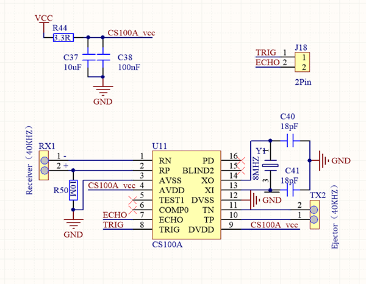

**Working principle:** 
As we all know, ultrasonic is a kind of inaudible sound wave signal with high frequency. Similar to a bat, this module measures distance of obstacles by calculating the time difference between wave-emitting and echo-receiving.

**Maximum distance:** 3M

**Minimum distance:** 5cm

**Detection angle:** ≤15°

### **3. Wiring Diagram**


### **4. Test Code**

According to its principle, we need a **pulseIn(pin, value)** function which is a pulse function in arduino IDE.

```c
/*
  keyestudio Nano Inventor Starter Kit
  Project 25.2 Ultrasonic Diastimeter
  http://www.keyestudio.com
*/
int distance = 0; //Define a variable to receive the distance value 
int EchoPin = 13; //Connect Echo pin to D13
int TrigPin = 12; //Connect Trig pin to D12

float checkdistance() { //Acquire the distance 
  //preserve a short low level to ensure a clear high pulse:
  digitalWrite(TrigPin, LOW);
  delayMicroseconds(2);    //Delay 2um
  // Trigger the sensor by a high pulse of 10um or longer 
  digitalWrite(TrigPin, HIGH);
  delayMicroseconds(10);		//Delay 10um
  digitalWrite(TrigPin, LOW);
  //Read the signal from the sensor: a high level pulse
  //Duration is detected from the point sending "ping" command to the time receiving echo signal (unit: um).
  float distance = pulseIn(EchoPin, HIGH) / 58.00;  //Convert into distance
  delay(10);
  return distance; //Return the distance value
}

void setup() {
  Serial.begin(9600);// Set the baud rate to 9600
  pinMode(TrigPin, OUTPUT);//Set Trig pin to output
  pinMode(EchoPin, INPUT);  //Set Echo pin to input 
}

void loop() {
  distance = checkdistance();   //Assign the read value to "distance"
  if (distance < 5 || distance >= 400) {  //Display "-1" if exceeding the detection range 
    distance = -1;
  }
 Serial.print("ditance: ");
 Serial.print(distance);
 Serial.println(" CM");
  delay(200);
}
```
### **5. Test Result**

After wiring up and uploading code, open serial monitor to set baud rate to 9600, the serial port prints the distance value. 


### **6. Expansion Code**

In this expansion project, let's make a diastimeter. 

We display characters on LCD 1602. Program to show "Keyestudio" at (3,0) and “distance:” at (0,1) followed by the distance value at (9,1). 

When the value is smaller than 100(or 10), a residue of the third(or the second) bit still exists. Therefore, an "if" judgement is necessary to determine a certain condition.

**Wiring Diagram:**


**Code:**

```C
/*
  keyestudio Nano Inventor Starter Kit
  Project 25.2 Ultrasonic Diastimeter
  http://www.keyestudio.com
*/
#include <Wire.h>
#include <LiquidCrystal_I2C.h>
LiquidCrystal_I2C lcd(0x27,16,2); // set the LCD address to 0x27 for a 16 chars and 2 line display

int distance = 0; //Define a variable to receive the diatance value 
int EchoPin = 13; //Conect Echo pin to D13
int TrigPin = 12; //Conect Trig pin to D12
float checkdistance() { //Acquire the distance 
  // preserve a short low level to ensure a clear high pulse:
  digitalWrite(TrigPin, LOW);
  delayMicroseconds(2);
  //Trigger the sensor by a high pulse of 10um or longer 
  digitalWrite(TrigPin, HIGH);
  delayMicroseconds(10);
  digitalWrite(TrigPin, LOW);
  // Read the signal from the sensor: a high level pulse
  //Duration is detected from the point sending "ping" command to the time receiving echo signal (unit: um).
  float distance = pulseIn(EchoPin, HIGH) / 58.00;  //Convert into distance
  delay(10);
  return distance;
}

void setup() {
  Serial.begin(9600);//Set the baud rate to 9600
  pinMode(TrigPin, OUTPUT);//Set Trig pin to output 
  pinMode(EchoPin, INPUT);  //Set Echopin to input 
lcd.init(); // initialize the lcd
// Print a message to the LCD.
lcd.backlight();
lcd.setCursor(3,0);
lcd.print("Keyestudio");
}

void loop() {
  distance = checkdistance();
 
  if (distance < 5 || distance >= 400) {  //Display "-1" if exceeding the detection range 
    distance = -1;
  }
  if(distance < 100 && distance > 10){     // Eliminate the third residual digit when the value drops to two digits
    lcd.setCursor(11,1);
    lcd.print(" ");
  }
  if(distance < 10){   //Eliminate the second residual digit when the value drops to one digit
    lcd.setCursor(10,1);
    lcd.print(" ");
  }
  lcd.setCursor(0,1);
  lcd.print("distance:");
  lcd.setCursor(9,1);
  lcd.print(distance);
  delay(200);
}
```

### **7. Code Explanation**

**float checkdistance()** 
Self-defining function. It greatly reduces loop() by collecting some specific codes which can be directly recalled.

**delayMicroseconds();** 
Delay function. delay()is in ms while delayMicroseconds() is in um for some precise delays. 

**pulseIn(pin, value)** 
Pulse-grabbing function. 
**pin:** the number of the Arduino pin on which you want to read the pulse. Allowed data types: int.
**value:** type of pulse to read: either HIGH or LOW. Allowed data types: int.


Please refer to offocil website for more details: 
[[pulseIn() - Arduino Reference](https://www.arduino.cc/reference/en/language/functions/advanced-io/pulsein/)]:

## **Project 26: Human Body Piano**

### **1. Description**
The analog piano includes a development board and an ultrasonic sensor. It plays different tones by detecting the position of your fingers. Thus, this module is able to stimulate a piano to perform music and songs. 

### **2. Flow Diagram**

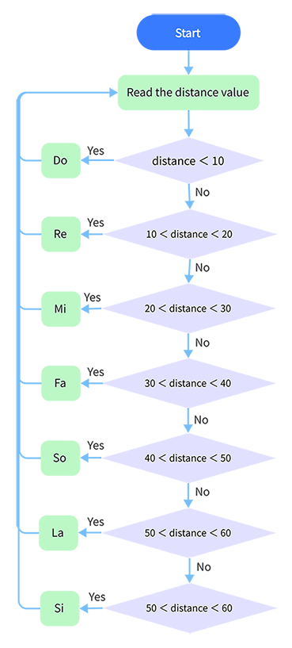

### **3. Wiring Diagram**


### **4. Test Code**

It is interesting that the played tones vary from distance of human's body. 

```C
/*
  keyestudio Nano Inventor Starter Kit
  Project 26 Human Body Piano
  http://www.keyestudio.com
*/
int distance = 0; //Define a variable to receive the distance 
int EchoPin = 13; //Connect Echo pin to D13
int TrigPin = 12; //Connect Trig pin to D12

int beeppin = 3;

float checkdistance() { //Acquire distance
  // preserve a short low level to ensure a clear high pulse:
  digitalWrite(TrigPin, LOW);
  delayMicroseconds(2);
  // Trigger the sensor by a high pulse of 10um or longer 
  digitalWrite(TrigPin, HIGH);
  delayMicroseconds(10);
  digitalWrite(TrigPin, LOW);
  // Read the signal from the sensor: a high level pulse
  //Duration is detected from the point sending "ping" command to the time receiving echo signal (unit: um).
  float distance = pulseIn(EchoPin, HIGH) / 58.00;  //Convert into distance
  delay(10);
  return distance;
}

void setup() {
  Serial.begin(9600);//Set the baud rate to 9600
  pinMode(TrigPin, OUTPUT);//Set Trig pin to output 
  pinMode(EchoPin, INPUT);  //Set Echopin to input 

}

void loop() {
  distance = checkdistance();
  if(distance < 10){             
    tone(beeppin, 262);//Play DO
    delay(1000);
  }
  if(distance < 20 && distance > 10){             
    tone(beeppin, 294);//Play Re
    delay(1000);
  }
  if(distance < 30 && distance > 20){             
    tone(beeppin, 330);//Play Mi
    delay(1000);
  }
  if(distance < 40 && distance > 30){             
    tone(beeppin, 349);//Play fa
    delay(1000);
  }
  if(distance < 50 && distance > 40){             
    tone(beeppin, 392);//Play So
    delay(1000);
  }
  if(distance < 60 && distance > 50){             
    tone(beeppin, 440);//Play La
    delay(1000);
  }
  if(distance < 70 && distance > 60){             
    tone(beeppin, 494);//Play Si
    delay(1000);
  }
  Serial.println(distance);
  noTone(beeppin);//Stop
}
```

### **5. Test Result**

Wire up and upload code. 
Play Do when the distance is smaller than 10. 
Play Re when the distance is within 10~20. 
Play Mi when the distance is within 20~30. 
Play Fa when the distance is within 30~40. 
Play So when the distance is within 40~50. 
Play La when the distance is within 50~60. 
Play Si when the distance is within 60~70. 

### **6. Code Explanation**

**||** : logical and operational signs. 
if (distance < 2 || distance >= 400): If one of the expressions satisfies the condition, it is true, otherwise it is false.


Please refer to official website for more details:
[[|| - Arduino Reference](https://www.arduino.cc/reference/en/language/structure/boolean-operators/logicalor/)]:

## **Project 27: Intelligent Parking**

### **1. Description**
This intelligent parking system detects and optimizes parking position via ultrasonic sensor. With this system, wrong parking is avoided to a large extent. 

Firstly, you need to install the sensor around the car-park. And then it will detect the distance between the car and its edges and send the information to the development board. After integration, the distance value will be revealed by the lines on the dot matrix display.

### **2. Flow Diagram**

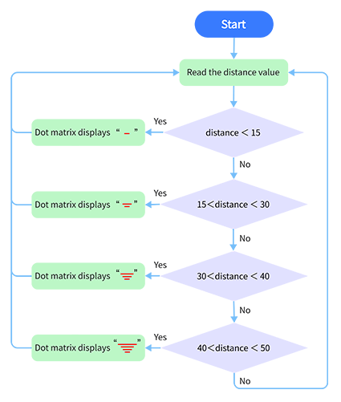

### **3. Wiring Diagram**


### **4. Test Code**

When parking, we can use ultrasonic to know the situation of blind spots. In this project, lines displayed on the dot matrix indicates the distance of back of the car. 

```C
/*
  keyestudio Nano Inventor Starter Kit
  Project 27 Intelligent Parking
  http://www.keyestudio.com
*/
#include <LedControl.h>  
  
int DIN = 11;     //Define DIN pin to D11
int CS =  10;     //Define CS pin to D10
int CLK = 13;     //Define CLK pin to D13 

int temp = 0;

int distance = 0; //Define a variable to receive the distance 
int EchoPin = 9; //Connect Echo pin to D9
int TrigPin = 8; //Connect Trig pin to D8
float checkdistance() { //Acquire distance
  // preserve a short low level to ensure a clear high pulse:
  digitalWrite(TrigPin, LOW);
  delayMicroseconds(2);
  // Trigger the sensor by a high pulse of 10um or longer 
  digitalWrite(TrigPin, HIGH);
  delayMicroseconds(10);
  digitalWrite(TrigPin, LOW);
  // Read the signal from the sensor: a high level pulse
  //Duration is detected from the point sending "ping" command to the time receiving echo signal (unit: um).
  float distance = pulseIn(EchoPin, HIGH) / 58.00;  //Convert into distance
  delay(10);
  return distance;
}

LedControl lc=LedControl(DIN,CLK,CS,4);  
byte data_val[4][8]= {
  {0x00, 0x00, 0x00, 0x01, 0x01, 0x00, 0x00, 0x00},
  {0x00, 0x00, 0x04, 0x05, 0x05, 0x04, 0x00, 0x00},
  {0x00, 0x10, 0x14, 0x15, 0x15, 0x14, 0x10, 0x00},
  {0x40, 0x50, 0x54, 0x55, 0x55, 0x54, 0x50, 0x40},
  };


void setup(){  
  lc.shutdown(0,false);       //MAX72XX is in power saving mode when starting   
  lc.setIntensity(0,8);       //Set the brightness to the maximum    
  lc.clearDisplay(0);         //Clear display    

  pinMode(TrigPin, OUTPUT);//Set Trig pin to output 
  pinMode(EchoPin, INPUT);  //Set Echopin to input 
  Serial.begin(9600);
}  
  
void loop(){   
  distance = checkdistance();
  Serial.println(distance);
  if(distance < 15){
    temp = 0;
  }
  else if(distance < 30 && distance >15){
    temp = 1;
  }
  else if (distance < 40 && distance > 30){
    temp = 2;
  }
  else if(distance > 50 ){
    temp = 3;
  }
  for(int i=0;i<8;i++)  
  {  
    lc.setRow(0,i,data_val[temp][i]);  
  } 
}  
  

```

### **5. Test Result**

After wiring up and uploading code, lines displays on the dot matrix. If the detected distance is shorter than 50cm, there will be fewer lines.

 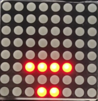


## **Project 28: Intelligent Gate**

### **1. Description**
The intelligent gate integrates MCU and ultrasonic sensor. It measures the distance of car to open or close gate handler. 

When a certain distance is reached, MCU receives the signal from the sensor and estimates the distance via the signal intensity. If the car is approaching or leaving, MCU will open or close the gate via a servo. 

### **2. Flow Diagram**


### **3. Wiring Diagram**


### **4. Test Code**

Add libraries to Arduino IDE. If you skip this step, an error will occur when uploading and compiling the code.
For how to add libraries, please refer to “Development Environment Configuration”. 

~~~C
/*
  keyestudio Nano Inventor Starter Kit
  Project 28 Intelligent Gate
  http://www.keyestudio.com
*/
#include <Servo.h>  //Servo library
Servo myservo;

int distance = 0; //Define a variable to receive the distance 
int EchoPin = 13; //Connect Echo pin to D13
int TrigPin = 12; //Connect Trig pin to D12

float checkdistance() { //Acquire distance
  // preserve a short low level to ensure a clear high pulse:
  digitalWrite(TrigPin, LOW);
  delayMicroseconds(2);
  // Trigger the sensor by a high pulse of 10um or longer 
  digitalWrite(TrigPin, HIGH);
  delayMicroseconds(10);
  digitalWrite(TrigPin, LOW);
  // Read the signal from the sensor: a high level pulse
  //Duration is detected from the point sending "ping" command to the time receiving echo signal (unit: um).
  float distance = pulseIn(EchoPin, HIGH) / 58.00;  //Convert into distance
  delay(10);
  return distance;
}

void setup() {
  myservo.attach(9);//Connect servo to digital port 9
  myservo.write(0);
  pinMode(TrigPin, OUTPUT);//set Trig pin to output 
  pinMode(EchoPin, INPUT);  //set Echo to input 
  Serial.begin(9600);
}

void loop() {
 distance = checkdistance();
 Serial.println();
  if(distance < 30){
    myservo.write(180);
    delay(5000);//Wait for 5s    
  }
  if(distance > 30){
    myservo.write(0);
  }
}
~~~

### **5. Test Result**

After wiring up and uploading code, the servo will turn to 180° and stay for 5s if the detected distance is shorter than 30cm. On the contrary, the servo will return to 0°.

## **Project 29: IR Remote Control**

### **1. Descreption**
This module uses IR to remotely control LED, which greatly simplifies the ON and OFF of LED. Now that the control is realized by IR signals, there is no need to worry about considerable circuits. 

### **2. Working Principle**

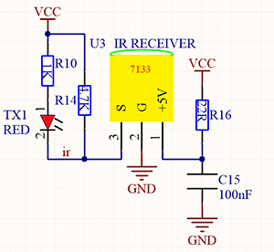

**Working principle:** 

In actual communication, signals usually carries a wide spectrum, and a lot of energy is distributed at a low frequency band. We called it baseband signal, which is not suitable for direct transmission in channels. 

For a convenient transmission, a high anti-disturbance capability and an effective utilization of Broadband, and signals, before transmitting, always need to be modulated to a frequency which is suitable for channels and noise characteristics. This is what we called signal modulation. 

At the receiver of the communication system, signals are usually demodulated to regain the initial baseband ones. In this project, we often use a carrier of about 38K in modulation. 

An IR remote control system is mainly split into modulation, emitting and receiving. It sends data through modulating, i.e., an "and" operation between data and carriers with a certain frequency. In this way, the emitting efficiency is enhanced while power dissipation is lowered. 

Generally, the frequency of carrier modulation is within 30khz~60khz, with 38kHz more often. The duty cycle of the square wave is 1/3, as shown below, which is decided by the 455kHz crystal oscillator on the emitting end. 

An Integer frequency division is essential for crystal oscillator at this end, and the frequency coefficient usually evaluates 12. Therefore, 455kHz÷12≈37.9kHz≈38kHz. 

**38KH carrier (complete) emitting diagram:**


**Carrier frequency:** 38KHz

**Wave length:** 940nm

**Receiving angle:** 90°

**Control distance:** 6M

**Schematic diagram of remote control buttons:**

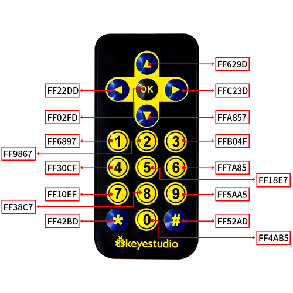

### **3. Wiring Diagram**


### **4. Test Code**

Add libraries to Arduino IDE. If you skip this step, an error will occur when uploading and compiling the code.
For how to add libraries, please refer to “Development Environment Configuration”. 


```C
/*
  keyestudio Nano Inventor Starter Kit
  Project 29.1 IR Remote Control
  http://www.keyestudio.com
*/
#include <IRremote.h> //IR remote receiving library 
long ir_rec;
IRrecv irrecv(3);
decode_results results;
void setup() {
  Serial.begin(9600);
  irrecv.enableIRIn();//Enable the IR Remote receiving 
}

void loop() {
  if (irrecv.decode(&results)) {//Receive signal 
    ir_rec = results.value; // assign the signal to the variable ir_rec
    if(ir_rec != 0){		//Prevente the code from repeating execute when the button is pressed and held ；The meaning of "!=" not equal to
    Serial.print(ir_rec, HEX); // Print the variable ir_rec in hexadecimal
    Serial.println();//wrap around to a new line
    }
    irrecv.resume();// Receive next time 
  }
}
```

### **5. Test Result**

After wiring up and uploading code, open the serial monitor and set the baud rate to 9600.  Press the button on the remote control unit, and you will see the value in hexadecimal.


### **6. Expansion Code**

In this expansion code, we will make a light controlled by an IR remote switch.  Press OK to light up the LED and press again to turn it off. This is a repeatable operation. So a reverse oprator “!” is necessary. 

**Wiring Diagram:**


**code:**

```C
/*
  keyestudio Nano Inventor Starter Kit
  Project 29.2 IR Remote Control
  http://www.keyestudio.com
*/
#include <IRremote.h> //IR remote receiving library 
boolean flag = true;//LED flag bit 
long ir_rec;
int led_val = 0;

int led = 4;
IRrecv irrecv(3);
decode_results results;
void setup() {
  Serial.begin(9600);
  pinMode(led, OUTPUT);//connect LED pin to PWM port 5
  irrecv.enableIRIn();//Enable the IR Remote receiving 
}

void loop() {
  if (irrecv.decode(&results)) {//Receive signal
    ir_rec = results.value; //assign the signal to the variable ir_rec
    if(ir_rec != 0){        //Prevente the code from repeating execute when the button is pressed and held ，The meaning of "!=" not equal to
        Serial.print(ir_rec, HEX); //Print the variable ir_rec in hexadecimal
      if(ir_rec == 0xFF02FD){       //Determine whether the received IR signal is from button OK
        led_val = !led_val;           //Reverse a variable. If the initial value is 0, it turns to 1 after reversing, and vice versa. 
        digitalWrite(led,led_val);
      }
    }
    Serial.println();//wrap around to a new line
    irrecv.resume();//Receive next time 
  }
}
```

## **Project 30: Smart Home**

### **1. Description**
In this technology era, we are all familiar with smart home. It is a system that can control electric appliance via simple buttons. 

In this project, we stimulate a smart home remotely controlled by infrared sensor. With Arduino MCU as its core, it realizes intelligent control of light, air conditioner, TV and security monitors. 

All in all, this smart home system is convenient and easy to use.

### **2. Flow Diagram**

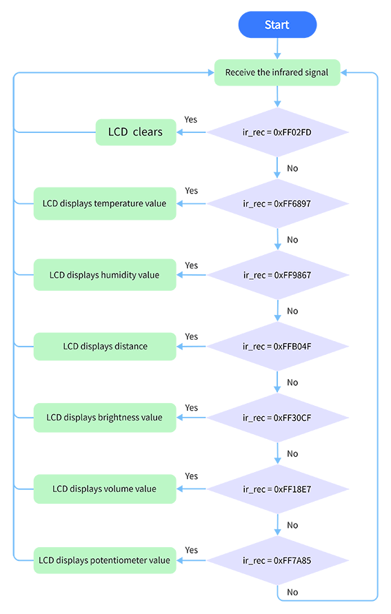

### **3. Wiring Diagram**


### **4. Test Code**

With the IR remote control, this smart home reveals various sensor values on LCD, including the value of temperature and humidity sensor, sound sensor, photosensor, potentiometer and ultrasonic sensor. 

```C
/*
  keyestudio Nano Inventor Starter Kit
  Project 30 Smart Home
  http://www.keyestudio.com
*/
#include <Wire.h>
#include <LiquidCrystal_I2C.h>
#include <IRremote.h>  //Upload IR remote receiveing library 
#include <dht11.h>     //include the library code:

LiquidCrystal_I2C lcd(0x27, 16, 2);  // set the LCD address to 0x27 for a 16 chars and 2 line display
boolean flag = true;  //LED flag bit 
long ir_rec;
long ir_val;
IRrecv irrecv(3);     //Define the IR remote contorl pin 
decode_results results;
dht11 DHT;
#define DHT11_PIN 4  //Define DHT11 to digital port 3
int distance = 0;  //Define a variable to receive the distance 
int EchoPin = 13;  //Connect Echo pin to D13
int TrigPin = 12;  //Connect Trig pin to D12
int ligth_sensor = A0;      //Define the photosensor pin 
int sound_sensor = A1;      //Define the sound sensor pin 
int pot_sensor = A2;        //Define the potentiometer sensor pin 

void setup() {
  // LCD initialization
  lcd.init();       //initialize the lcd
  lcd.backlight();  //initialize the LCD backlight 
  //LCD displays the fixed characters “keyestudio”
  lcd.setCursor(3, 0);
  lcd.print("keyestudio");
  //IR remote
  irrecv.enableIRIn();  //Enable the IR Remote receiving 
  //Set the pin mode of the ultrasonic interface 
  pinMode(TrigPin, OUTPUT);  //Set Trig pin to output 
  pinMode(EchoPin, INPUT);   //Set Echo pin to input 
}

void loop() {
  if (irrecv.decode(&results)) {  //Receive signal 
    ir_rec = results.value;       //assign the signal to the variable ir_rec
    if(ir_rec != 0){
      ir_val = ir_rec;
      show_clear();  
    }  
    irrecv.resume();              //Receive next time
  }
  switch (ir_val) {
    case 0xFF02FD: show_clear(); break;
    case 0xFF6897: show_temperature(); break;
    case 0xFF9867: show_humidity(); break;
    case 0xFFB04F: show_distance(); break;
    case 0xFF30CF: show_luminance(); break;
    case 0xFF18E7: show_sound(); break;
    case 0xFF7A85: show_pot(); break;
  }
  delay(300);
}

void show_clear() {  //Clear the display 
  lcd.setCursor(0, 1);
  lcd.print("                ");
}

void show_temperature() {  //Display Temperature value 
  int chk = DHT.read(DHT11_PIN);
  int value = DHT.temperature;
  lcd.setCursor(0, 1);
  lcd.print("Temperature:");
  lcd.setCursor(13, 1);
  lcd.print(value);
  Serial.println("1");
  if (value < 100) {
    lcd.setCursor(15, 1);
    lcd.print(" ");
  }
}

void show_humidity() {  //Display humudity value 
  int chk = DHT.read(DHT11_PIN);
  int value = DHT.humidity;
  lcd.setCursor(0, 1);
  lcd.print("Humidity:");
  lcd.setCursor(10, 1);
  lcd.print(value);
  Serial.println("2");
  if (value < 100) {
    lcd.setCursor(12, 1);
    lcd.print(" ");
  }
}

float checkdistance() {  //Acquire the distance 
  //preserve a short low level to ensure a clear high pulse
  digitalWrite(TrigPin, LOW);
  delayMicroseconds(2);
  //Trigger the sensor by a high pulse of 10um or longer 
  digitalWrite(TrigPin, HIGH);
  delayMicroseconds(10);
  digitalWrite(TrigPin, LOW);
  //Read the signal from the sensor: a high level pulse
  //Duration is detected from the point sending "ping" command to the time receiving echo signal (unit: um).
  float distance = pulseIn(EchoPin, HIGH) / 58.00;  //Convert into distance
  delay(10);
  return distance;
}

void show_distance() {  //Display the distance value 
  distance = checkdistance();
  // if (distance < 2 || distance >= 400) {  //Display "-1" if exceeding the detection range 
  //   distance = -1;
  // }
  lcd.setCursor(0, 1);
  lcd.print("distance:");
  lcd.setCursor(9, 1);
  lcd.print(distance);
  if (distance < 100 && distance > 10) {  //Eliminate the third residual digit when the value drops to two digits
    lcd.setCursor(11, 1);
    lcd.print(" ");
  }
  if (distance < 10) {  //Eliminate the second residual digit when the value drops to one digit
    lcd.setCursor(10, 1);
    lcd.print(" ");
  }
}

void show_luminance() {  //Read the analog luminance value 
  int value = analogRead(ligth_sensor);
  lcd.setCursor(0, 1);
  lcd.print("Luminance:");
  lcd.setCursor(11, 1);
  lcd.print(value);
  if (value < 1000) {
    lcd.setCursor(14, 1);
    lcd.print(" ");
  }
  if (value < 100) {
    lcd.setCursor(13, 1);
    lcd.print(" ");
  }
  if (value < 10) {
    lcd.setCursor(12, 1);
    lcd.print(" ");
  }
}

void show_sound() {  //Read the analog ambient sound value 
  int value = analogRead(sound_sensor);
  lcd.setCursor(0, 1);
  lcd.print("Sound:");
  lcd.setCursor(7, 1);
  lcd.print(value);
  if (value < 1000) {
    lcd.setCursor(10, 1);
    lcd.print(" ");
  }
  if (value < 100) {
    lcd.setCursor(9, 1);
    lcd.print(" ");
  }
  if (value < 10) {
    lcd.setCursor(8, 1);
    lcd.print(" ");
  }
}

void show_pot() {  //Read the analog potentiometer value 
  int value = analogRead(pot_sensor);
  lcd.setCursor(0, 1);
  lcd.print("PotAnalog:");
  lcd.setCursor(11, 1);
  lcd.print(value);
  if (value < 1000) {
    lcd.setCursor(14, 1);
    lcd.print(" ");
  }
  if (value < 100) {
    lcd.setCursor(13, 1);
    lcd.print(" ");
  }
  if (value < 10) {
    lcd.setCursor(12, 1);
    lcd.print(" ");
  }
}

```

### **5. Test Result**

After wiring up and uploading code, press buttons and observe the displayed contents on LCD.

Press button 1 to display temperature value.


Press button 2 to display humidity value.


Press button 3 to display distance value.


Press button 4 to display luminance value.


Press button 5 to display the analog sound volume. 


Press button 6 to display the analog potentiometer value. 


Press button OK to clear the display. 


